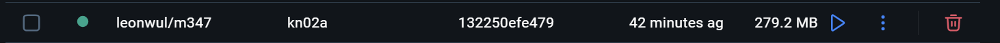
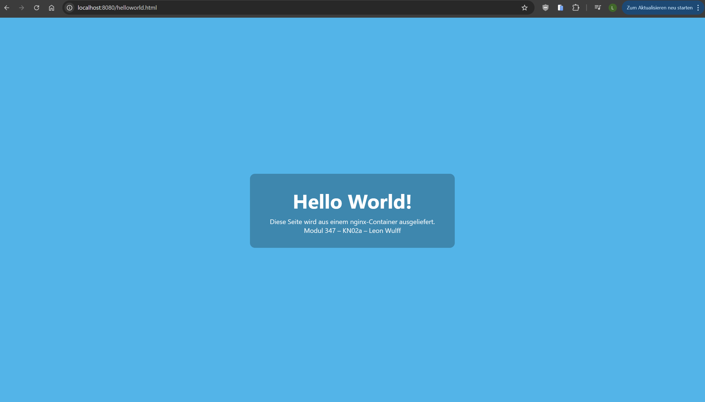
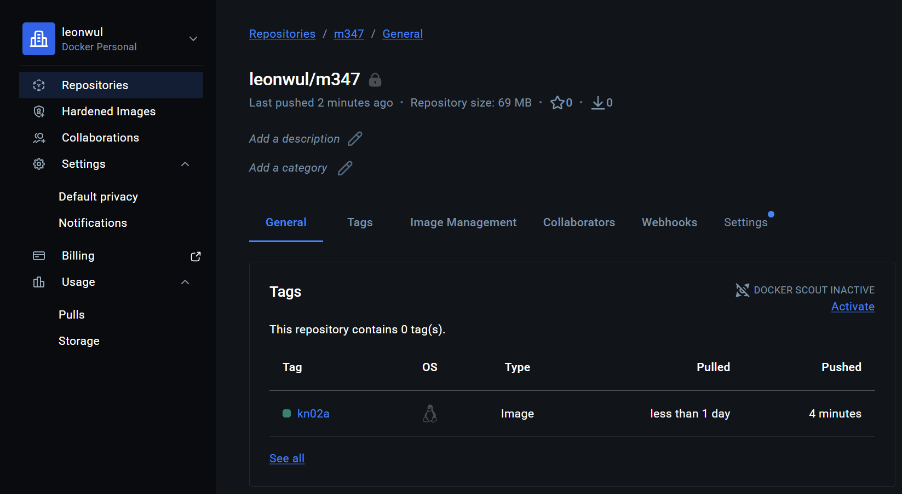
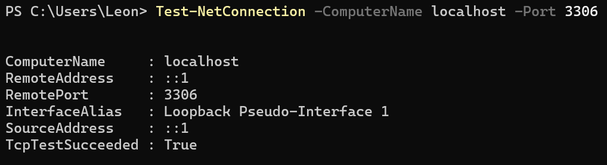
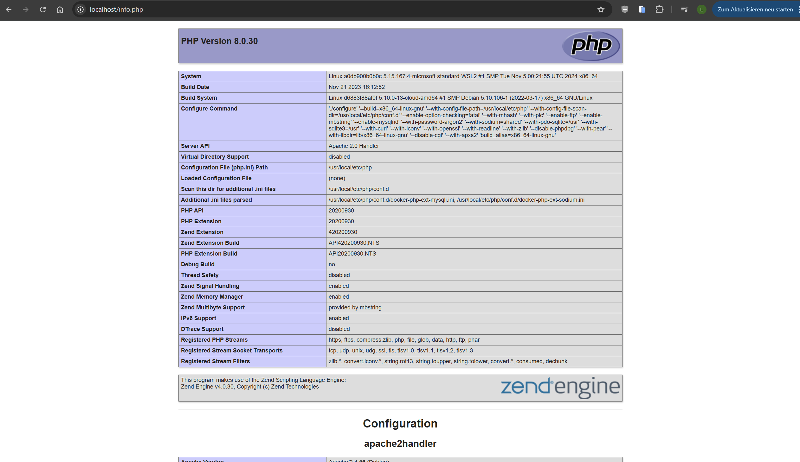
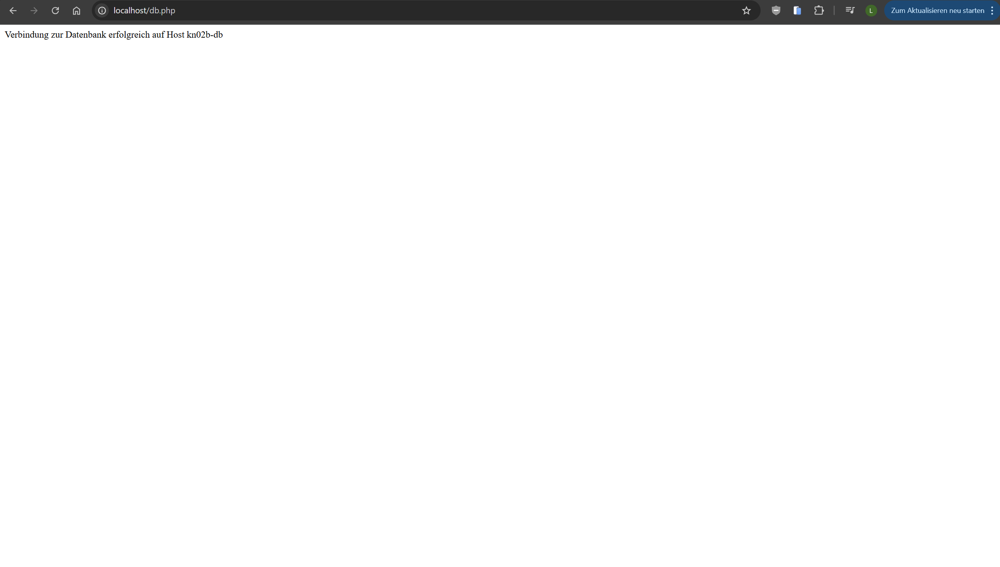

# KN02: Dockerfile

**Modul 347 – Dienst mit Container anwenden**
**Autor:** Leon Wulff

## Inhaltsverzeichnis

- [A) Dockerfile I – nginx mit eigener HTML-Seite](#a-dockerfile-i--nginx-mit-eigener-html-seite)
  - [Dokumentation des vorgegebenen Dockerfiles](#dokumentation-des-vorgegebenen-dockerfiles)
  - [Eigenes Dockerfile (kn02a)](#eigenes-dockerfile-kn02a)
  - [Befehle (Build, Run, Push)](#befehle-build-run-push)
  - [Screenshots (Teil A)](#screenshots-teil-a)
  - [Abgaben-Checkliste Teil A](#abgaben-checkliste-teil-a)
- [B) Dockerfile II – PHP-Web + MariaDB](#b-dockerfile-ii--php-web--mariadb)
  - [DB-Container `kn02b-db`](#db-container-kn02b-db)
  - [Web-Container `kn02b-web`](#web-container-kn02b-web)
  - [Networking mit `--link`](#networking-mit---link)
  - [Screenshots (Teil B)](#screenshots-teil-b)
  - [Abgaben-Checkliste Teil B](#abgaben-checkliste-teil-b)

> **Hinweis Docker Hub:** In allen Befehlen steht `leonwul` als Platzhalter. Vor dem ersten `docker push` einmalig auf [hub.docker.com](https://hub.docker.com) mit TBZ-Email anmelden, privates Repo `m347` erstellen und im Terminal `docker login` ausführen. Danach `leonwul` durch den eigenen Docker-Hub-Namen ersetzen.

---

## A) Dockerfile I – nginx mit eigener HTML-Seite

### Dokumentation des vorgegebenen Dockerfiles

Der TBZ-Auftrag gibt folgendes Dockerfile-Snippet vor:

```dockerfile
FROM nginx
COPY static-html-directory /var/www/html
EXPOSE 80
```

Zeile für Zeile in eigenen Worten:

| Zeile | Erklärung |
|-------|-----------|
| `FROM nginx` | Legt das **Basis-Image** fest. Hier wird das offizielle `nginx`-Image von Docker Hub als Ausgangsbasis verwendet. Alle weiteren Anweisungen bauen darauf einen zusätzlichen Layer auf. |
| `COPY static-html-directory /var/www/html` | Kopiert den lokalen Ordner `static-html-directory` (aus dem Build-Kontext) in das Verzeichnis `/var/www/html` im Image. **Wichtig:** Der Pfad `/var/www/html` ist für nginx falsch – das ist der DocumentRoot von Apache. nginx liefert standardmässig aus `/usr/share/nginx/html` aus. Diese Zeile passe ich im eigenen Dockerfile an. |
| `EXPOSE 80` | Dokumentiert, dass der Container intern auf Port **80** lauscht (HTTP). Diese Anweisung publiziert den Port nicht automatisch – das passiert erst beim `docker run` mit `-p`. `EXPOSE` ist primär Metadaten/Doku für andere Tools. |

### Eigenes Dockerfile (kn02a)

Datei: [`Dockerfile.kn02a`](./Dockerfile.kn02a)

```dockerfile
FROM nginx
WORKDIR /usr/share/nginx/html
COPY helloworld.html .
EXPOSE 80
```

**Anpassungen gegenüber dem vorgegebenen Snippet:**

- `WORKDIR /usr/share/nginx/html` setzt das Arbeitsverzeichnis im Image auf den DocumentRoot von nginx (laut [Docker Hub Doku des nginx-Images](https://hub.docker.com/_/nginx)).
- `COPY helloworld.html .` nutzt den relativen Punkt `.` als Ziel – kopiert also nach `WORKDIR`. **Kein absoluter Pfad mehr nötig**, genau wie im Auftrag verlangt.

Die HTML-Datei liegt im selben Ordner: [`helloworld.html`](./helloworld.html).

### Befehle (Build, Run, Push)

Alle Befehle aus dem Ordner `KN-02/` ausführen.

```bash
# 1) Image bauen (mit Tag, der direkt für Docker Hub passt)
docker build -f Dockerfile.kn02a -t leonwul/m347:kn02a .

# 2) Container starten – Port 8080 auf Host -> 80 im Container
docker run -d --name kn02a -p 8080:80 leonwul/m347:kn02a

# 3) Seite im Browser aufrufen
#    http://localhost:8080/helloworld.html

# 4) Image in privates Docker-Hub-Repo pushen
#    (vorher einmalig: docker login)
docker push leonwul/m347:kn02a

# 5) Aufräumen (erst nach Abnahme!)
docker stop kn02a
docker rm kn02a
```

### Screenshots (Teil A)

**Docker Desktop** zeigt das fertig gebaute Image `leonwul/m347:kn02a` lokal:



**Browser** ruft die Seite `helloworld.html` aus dem laufenden Container ab (Port-Mapping 8080 → 80):



**Docker Hub** bestätigt zusätzlich, dass der Push ins private Repository `leonwul/m347` mit Tag `kn02a` erfolgreich war:



### Abgaben-Checkliste Teil A

- [x] Dokumentiertes Dockerfile (siehe Tabelle oben)
- [x] Eigenes Dockerfile mit `WORKDIR`, `COPY`, `EXPOSE` ([`Dockerfile.kn02a`](./Dockerfile.kn02a))
- [x] Notwendige `docker build` Befehle mit korrektem Tag (s. oben)
- [x] Notwendige `docker run` und `docker push` Befehle (s. oben)
- [x] Screenshot Docker Desktop mit Image `kn02a`
- [x] Screenshot der `helloworld.html` im Browser

---

## B) Dockerfile II – PHP-Web + MariaDB

Ziel: zwei Container, die zusammen die beiden m346-Seiten `info.php` und `db.php` ausliefern. Reihenfolge: **erst DB, dann Web** (so verlangt es der Auftrag, weil die Web-App auf die DB zugreift).

### DB-Container `kn02b-db`

#### Dockerfile

Datei: [`Dockerfile.kn02b-db`](./Dockerfile.kn02b-db)

```dockerfile
FROM mariadb:latest
ENV MARIADB_ROOT_PASSWORD=Test1234!
ENV MARIADB_DATABASE=m347db
EXPOSE 3306
```

**Erklärung der Anweisungen:**

- `FROM mariadb:latest` – offizielles MariaDB-Image als Basis.
- `ENV MARIADB_ROOT_PASSWORD=Test1234!` – setzt das Root-Passwort. Im eigenen Image als Layer fest verdrahtet, damit beim `docker run` keine `-e`-Parameter mehr nötig sind (so wie im Auftrag verlangt).
- `ENV MARIADB_DATABASE=m347db` – legt beim ersten Start automatisch eine leere DB `m347db` an.
- `EXPOSE 3306` – Standard-Port von MariaDB/MySQL.

> **Sicherheitsnotiz:** Credentials im Image zu hinterlegen ist für Produktion ein Anti-Pattern – jeder, der das Image hat, kann das Passwort auslesen (`docker history` oder `docker inspect`). Im Schulkontext und in einem **privaten** Repo ist das laut Auftrag in Ordnung. Saubere Lösung: Compose mit `.env` (kommt in KN-04).

#### Befehle DB

```bash
docker build -f Dockerfile.kn02b-db -t leonwul/m347:kn02b-db .
docker run -d --name kn02b-db -p 3306:3306 leonwul/m347:kn02b-db
docker push leonwul/m347:kn02b-db
```

#### Verbindungstest

Der Auftrag verlangt einen `telnet`-Test. Auf Windows ist der Telnet-Client standardmässig nicht aktiviert, deshalb wurde stattdessen das **äquivalente PowerShell-Cmdlet** `Test-NetConnection` verwendet, das genau dasselbe macht (TCP-Verbindung zum Port aufbauen):

```powershell
Test-NetConnection -ComputerName localhost -Port 3306
```

Ausgabe:

```
ComputerName     : localhost
RemoteAddress    : ::1
RemotePort       : 3306
InterfaceAlias   : Loopback Pseudo-Interface 1
SourceAddress    : ::1
TcpTestSucceeded : True
```

**`TcpTestSucceeded : True`** ist der Beweis: Port 3306 ist offen und der DB-Server im Container nimmt Verbindungen entgegen.

> Alternativen: `telnet localhost 3306` (nach `dism /online /Enable-Feature /FeatureName:TelnetClient` als Admin), oder Login direkt im Container: `docker exec -it kn02b-db mariadb -uroot -pTest1234! -e "SHOW DATABASES;"`.

### Web-Container `kn02b-web`

#### Dockerfile

Datei: [`Dockerfile.kn02b-web`](./Dockerfile.kn02b-web)

```dockerfile
FROM php:8.0-apache
RUN docker-php-ext-install mysqli
COPY info.php /var/www/html/
COPY db.php /var/www/html/
EXPOSE 80
```

**Erklärung der Anweisungen:**

- `FROM php:8.0-apache` – Image-Variante mit PHP **und** Apache (statt der Skripting-Variante ohne Webserver, wie im Auftrag erwähnt).
- `RUN docker-php-ext-install mysqli` – führt **beim Build** das Helper-Skript des PHP-Images aus, das die `mysqli`-Erweiterung kompiliert/aktiviert. `RUN` führt Shell-Befehle beim Image-Build aus und persistiert das Ergebnis als neuer Layer.
- `COPY info.php /var/www/html/` und `COPY db.php /var/www/html/` – legen die beiden PHP-Dateien in den DocumentRoot von Apache (`/var/www/html/` ist Default im offiziellen Image).
- `EXPOSE 80` – Apache lauscht auf 80.

#### Angepasste PHP-Dateien

**`info.php`** – zeigt die PHP-Konfiguration und bestätigt damit, dass PHP läuft:

```php
<?php
phpinfo();
```

**`db.php`** – baut eine mysqli-Verbindung zum DB-Container auf:

```php
<?php
$host = 'kn02b-db';
$user = 'root';
$pass = 'Test1234!';
$db   = 'mysql';

$conn = new mysqli($host, $user, $pass, $db);

if ($conn->connect_error) {
    die('Verbindung fehlgeschlagen: ' . $conn->connect_error);
}

echo 'Verbindung zur Datenbank erfolgreich auf Host ' . $host;

$conn->close();
```

**Wichtige Anpassungen gegenüber der m346-Version:**

| Stelle | Wert | Warum |
|--------|------|-------|
| `$host` | `kn02b-db` | Nicht `localhost`! Durch `--link kn02b-db` schreibt Docker beim Start des Web-Containers einen Eintrag mit diesem Namen in dessen `/etc/hosts`. Der Container-Name = Hostname. |
| `$user` / `$pass` | `root` / `Test1234!` | Laut Auftrag den **root**-Benutzer verwenden, weil der zusätzliche User keine Rechte auf die `mysql`-DB hätte. Passwort kommt aus `MARIADB_ROOT_PASSWORD` im DB-Dockerfile. |
| `$db` | `mysql` | Die `mysql`-Datenbank ist standardmässig vorhanden und root hat Zugriff – garantiert ein Connect-Test ohne weitere Vorarbeit. |

#### Befehle Web

```bash
docker build -f Dockerfile.kn02b-web -t leonwul/m347:kn02b-web .
docker run -d --name kn02b-web -p 80:80 --link kn02b-db leonwul/m347:kn02b-web
docker push leonwul/m347:kn02b-web
```

Aufruf:
- http://localhost/info.php
- http://localhost/db.php

### Networking mit `--link`

`--link kn02b-db` macht zwei Dinge im Web-Container:

1. **DNS-Eintrag:** Fügt in `/etc/hosts` einen Eintrag hinzu, der `kn02b-db` auf die IP des DB-Containers auflöst.
2. **Env-Variablen:** Setzt Umgebungsvariablen wie `KN02B_DB_PORT_3306_TCP` mit Adresse/Port.

Genau deshalb funktioniert `$host = 'kn02b-db'` in der `db.php`.

> `--link` ist offiziell **deprecated** – Docker empfiehlt User-defined Networks (kommt in **KN-03**). Im Auftrag steht es aber explizit drin, deshalb hier verwendet.

### Screenshots (Teil B)







### Abgaben-Checkliste Teil B

**DB:**
- [x] Verbindungstest-Screenshot (`Test-NetConnection localhost 3306` → `TcpTestSucceeded : True`)
- [x] Dockerfile DB-Container ([`Dockerfile.kn02b-db`](./Dockerfile.kn02b-db))
- [x] `docker build` + `docker run` Befehle für DB (s. oben)

**Web:**
- [x] Screenshots `info.php` + `db.php` im Browser
- [x] Dockerfile Web-Container ([`Dockerfile.kn02b-web`](./Dockerfile.kn02b-web))
- [x] `docker build` + `docker run` Befehle für Web (s. oben)
- [x] Angepasste PHP-Dateien ([`info.php`](./info.php), [`db.php`](./db.php))

**Push:**
- [x] Beide Images mit Tags `kn02b-db` und `kn02b-web` in privates Repo gepusht
