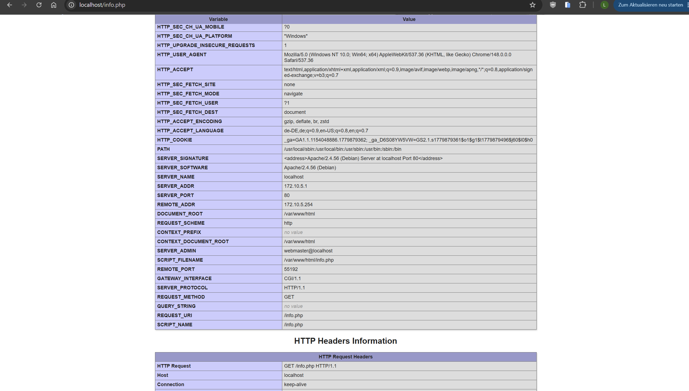
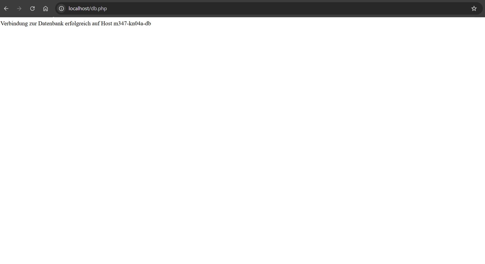
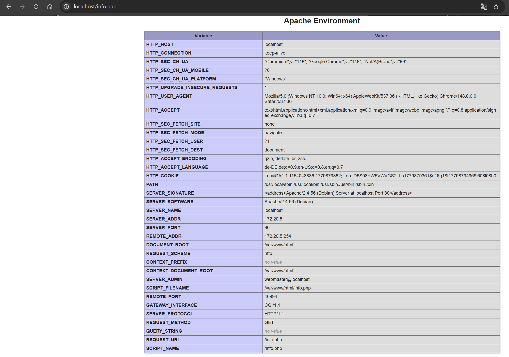
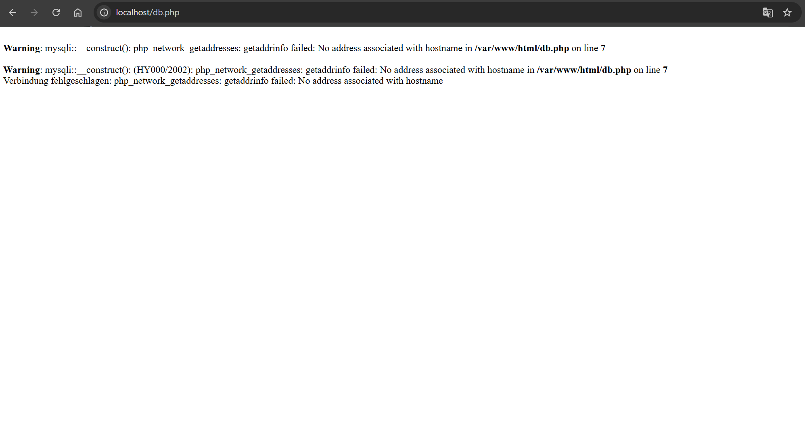
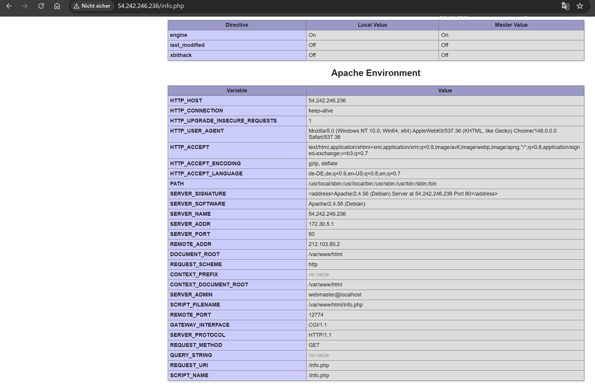
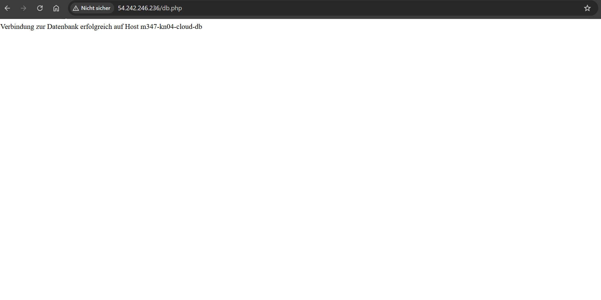

# KN04: Docker Compose

**Modul 347 – Dienst mit Container anwenden**
**Autor:** Leon Wulff

## Inhaltsverzeichnis

- [A.a) Lokal mit eigenen Builds](#aa-lokal-mit-eigenen-builds)
  - [Compose-File](#compose-file-kn04a)
  - [Dockerfile Webserver](#dockerfile-webserver)
  - [Netzwerk-Konfiguration erklärt](#netzwerk-konfiguration-erklärt)
  - [Befehle](#befehle-teil-aa)
  - [Screenshots](#screenshots-teil-aa)
- [A.b) Lokal mit publizierten Images](#ab-lokal-mit-publizierten-images)
  - [Compose-File](#compose-file-kn04b)
  - [Befehle](#befehle-teil-ab)
  - [Screenshots](#screenshots-teil-ab)
  - [Fehler-Erklärung (db.php)](#fehler-erklärung-dbphp)
- [`docker compose up` zerlegt](#docker-compose-up-zerlegt)
- [B) Cloud (AWS Academy)](#b-cloud-aws-academy)
  - [Cloud-Init-Datei](#cloud-init-datei)
  - [Deployment auf AWS Academy](#deployment-auf-aws-academy)
  - [Screenshots](#screenshots-teil-b)
- [Abgaben-Checkliste](#abgaben-checkliste)

> **Hinweis Docker Hub:** Alle Befehle nutzen `leonwul/m347` als Repo. Für Teil A.b muss `docker login` einmal ausgeführt sein, damit Compose die privaten Images ziehen kann.

---

## A.a) Lokal mit eigenen Builds

### Compose-File (kn04a)

Datei: [`docker-compose.kn04a.yml`](./docker-compose.kn04a.yml)

```yaml
services:
  web:
    build:
      context: .
      dockerfile: Dockerfile.kn04-web
    container_name: m347-kn04a-web
    ports:
      - "80:80"
    networks:
      - kn04a-net
    depends_on:
      - db

  db:
    image: mariadb:latest
    container_name: m347-kn04a-db
    environment:
      MARIADB_ROOT_PASSWORD: Test1234!
      MARIADB_DATABASE: m347db
    networks:
      - kn04a-net

networks:
  kn04a-net:
    driver: bridge
    ipam:
      config:
        - subnet: 172.10.0.0/16
          ip_range: 172.10.5.0/24
          gateway: 172.10.5.254
```

**Erklärungen:**

- **`web` Service** nutzt `build:` → Compose baut das Image lokal aus `Dockerfile.kn04-web` (siehe nächster Abschnitt). Genau das, was der Auftrag verlangt: Web-Container kommt aus eigenem Dockerfile, DB direkt aus Image.
- **`db` Service** nutzt `image: mariadb:latest` direkt + setzt `MARIADB_ROOT_PASSWORD` und `MARIADB_DATABASE` als `environment:` — **kein eigenes Dockerfile** für die DB, wie verlangt. Im KN-02 standen diese Werte im `Dockerfile.kn02b-db` als `ENV` — hier ist die Compose-YAML der bessere Ort (kein extra Image-Layer mit hardcoded Credentials).
- **`container_name:`** fixiert die Namen `m347-kn04a-web` und `m347-kn04a-db`. Ohne diese Zeile würde Compose Namen wie `kn-04_web_1` generieren.
- **`depends_on: db`** beim Web-Service sorgt für die richtige **Startreihenfolge** (DB wird vor Web gestartet). Wartet aber nicht darauf, dass MariaDB tatsächlich Verbindungen akzeptiert — kann beim ersten Aufruf von `db.php` zu einem kurzen "Connection refused" führen, einfach Page reloaden.

### Dockerfile Webserver

Datei: [`Dockerfile.kn04-web`](./Dockerfile.kn04-web) (1:1 wiederverwendet aus KN-02)

```dockerfile
FROM php:8.0-apache
RUN docker-php-ext-install mysqli
COPY info.php /var/www/html/
COPY db.php /var/www/html/
EXPOSE 80
```

Wichtig: `db.php` wurde gegenüber KN-02 angepasst — `$host = 'm347-kn04a-db'` statt `'kn02b-db'`, weil der DB-Container in Compose so heisst. Compose macht den `container_name` im benutzerdefinierten Netz als DNS-Name verfügbar — kein `--link` mehr nötig.

### Netzwerk-Konfiguration erklärt

```yaml
networks:
  kn04a-net:
    driver: bridge
    ipam:
      config:
        - subnet: 172.10.0.0/16
          ip_range: 172.10.5.0/24
          gateway: 172.10.5.254
```

| Feld | Wert | Bedeutung |
|------|------|-----------|
| `driver: bridge` | bridge | Standard-Netzwerk-Treiber für Container auf demselben Host. Container im selben Bridge-Netz können sich über Container-Namen ansprechen. |
| `subnet` | `172.10.0.0/16` | Der **gesamte Adressraum** des Netzes — 65.536 mögliche IPs. |
| `ip_range` | `172.10.5.0/24` | Aus diesem **engeren Bereich** (256 IPs) vergibt Docker automatisch IPs an Container. Der Rest des `subnet` bleibt frei für statische Reservierungen. |
| `gateway` | `172.10.5.254` | Das Gateway des Netzes — wird vom Host an die Container weitergegeben. |

Effekt: Beide Container kriegen IPs aus `172.10.5.x`, was sich beim `phpinfo()` als `SERVER_ADDR` zeigt → beweist, dass das eigene Netz greift.

### Befehle (Teil A.a)

Alle Befehle aus dem Ordner `KN-04/` ausführen.

```bash
# Bauen + Starten in einem Rutsch (--build erzwingt Rebuild des Web-Images)
docker compose -f docker-compose.kn04a.yml up -d --build

# Status checken
docker ps
docker network inspect kn-04_kn04a-net

# Browser-Aufrufe:
#   http://localhost/info.php   →  runter scrollen bis PHP Variables → REMOTE_ADDR + SERVER_ADDR
#   http://localhost/db.php     →  "Verbindung zur Datenbank erfolgreich auf Host m347-kn04a-db"

# Stoppen + Aufräumen (Netzwerk und Container weg, Images bleiben)
docker compose -f docker-compose.kn04a.yml down
```

### Screenshots (Teil A.a)

**`info.php`** — runter gescrollt bis zur Tabelle "PHP Variables". `REMOTE_ADDR` und `SERVER_ADDR` sind sichtbar; beide liegen im konfigurierten Netz-Range `172.10.5.x`:



**`db.php`** — DB-Verbindung über den Compose-DNS-Namen `m347-kn04a-db` erfolgreich:



---

## A.b) Lokal mit publizierten Images

Hier nutzen wir die **bereits publizierten Images aus KN-02** (`leonwul/m347:kn02b-web` und `leonwul/m347:kn02b-db`). Compose-File wurde gegenüber Teil A.a aufgeräumt — **kein `build:` mehr**, kein Dockerfile mehr nötig.

### Compose-File (kn04b)

Datei: [`docker-compose.kn04b.yml`](./docker-compose.kn04b.yml)

```yaml
services:
  web:
    image: leonwul/m347:kn02b-web
    container_name: m347-kn04b-web
    ports:
      - "80:80"
    networks:
      - kn04b-net
    depends_on:
      - db

  db:
    image: leonwul/m347:kn02b-db
    container_name: m347-kn04b-db
    networks:
      - kn04b-net

networks:
  kn04b-net:
    driver: bridge
    ipam:
      config:
        - subnet: 172.20.0.0/16
          ip_range: 172.20.5.0/24
          gateway: 172.20.5.254
```

**Was sich gegenüber Teil A.a geändert hat:**

- **`build:` entfernt**, durch `image:` ersetzt → Compose zieht die Images aus Docker Hub statt selbst zu bauen
- **`environment:` beim DB-Service entfernt** → die Credentials sind schon im Image `leonwul/m347:kn02b-db` als `ENV` verbacken (siehe KN-02 Dockerfile)
- **Anderer IP-Range:** `172.20.x` statt `172.10.x` (Auftragsforderung)
- **Andere Container-Namen:** `m347-kn04b-*` statt `m347-kn04a-*` (zur Trennung)

### Befehle (Teil A.b)

```bash
# Vorab einmalig: docker login (für private Images aus leonwul/m347)
docker compose -f docker-compose.kn04b.yml up -d

# Browser:
#   http://localhost/info.php  →  Screenshot (jetzt 172.20.5.x)
#   http://localhost/db.php    →  Screenshot mit FEHLERMELDUNG

docker compose -f docker-compose.kn04b.yml down
```

### Screenshots (Teil A.b)

**`info.php`** — IP-Range hat sich auf `172.20.5.x` geändert:



**`db.php`** — schlägt **bewusst** fehl (Erklärung unten):



### Fehler-Erklärung (db.php)

Das publizierte Image `leonwul/m347:kn02b-web` enthält die `db.php` aus **KN-02**. Diese hat den DB-Hostnamen **fest verdrahtet**:

```php
$host = 'kn02b-db';   // hardcoded aus KN-02
```

Im neuen Compose-Setup heisst der DB-Container aber `m347-kn04b-db`. DNS im Container-Netz findet keinen Host `kn02b-db` → mysqli wirft:

```
Warning: mysqli::__construct(): php_network_getaddresses: getaddrinfo failed:
No address associated with hostname in /var/www/html/db.php on line 7
Verbindung fehlgeschlagen: php_network_getaddresses: getaddrinfo failed:
No address associated with hostname
```

**Drei mögliche Lösungen:**

1. **Container umbenennen** (einfachste Lösung): `container_name: kn02b-db` für den DB-Service in der Compose-Datei. Der hardcoded Hostname löst dann wieder auf — ohne dass das Image geändert werden muss.
2. **Netzwerk-Alias** verwenden:
   ```yaml
   db:
     image: leonwul/m347:kn02b-db
     networks:
       kn04b-net:
         aliases:
           - kn02b-db
   ```
   Damit ist der DB-Container zusätzlich unter dem alten Namen `kn02b-db` erreichbar.
3. **Sauberste Lösung (Production-Style):** `db.php` parametrisieren, sodass der Hostname aus einer Env-Variable kommt:
   ```php
   $host = getenv('DB_HOST') ?: 'localhost';
   ```
   Image neu bauen + pushen. In Compose dann `environment: DB_HOST: db` setzen. Damit ist das Image vom konkreten Setup entkoppelt.

---

## `docker compose up` zerlegt

`docker compose up` ist eine **Zusammenfassung mehrerer Befehle**. Was es intern macht:

| Phase | Compose-Sub-Befehl | Entsprechung als Standalone-Docker-Befehl |
|-------|--------------------|-------------------------------------------|
| Images holen | `docker compose pull` | `docker pull <image>` für jeden Service ohne `build:` |
| Images bauen | `docker compose build` | `docker build -t <name> .` für jeden Service mit `build:` |
| Netzwerke anlegen | (Teil von `create`) | `docker network create --driver bridge ...` für jedes Netz im File |
| Volumes anlegen | (Teil von `create`) | `docker volume create <name>` für jedes Volume im File |
| Container erstellen | `docker compose create` | `docker create --name <n> --network <net> -p <port> <image>` pro Service |
| Container starten | `docker compose start` | `docker start <n>` pro Service |
| Logs anhängen (nur ohne `-d`) | `docker compose logs -f` | `docker logs -f <n>` pro Service, parallel im Terminal |

**Kurzfassung:** `docker compose up` = `pull` (wo nötig) + `build` (wo `build:` definiert) + `create` (Netze, Volumes, Container) + `start` (Container). Mit `-d` (detached) entfällt das Logs-Attach am Ende, der Befehl gibt das Terminal sofort frei.

Mit `up --build` wird `build` immer erzwungen, auch wenn das Image schon lokal existiert. Praktisch wenn man am Dockerfile oder den kopierten Dateien etwas geändert hat.

---

## B) Cloud (AWS Academy)

Teil B verlangt, dasselbe Setup wie Teil A in einer **VM in der Cloud** laufen zu lassen statt lokal. Plattform ist das **AWS Academy Learner Lab** (aus m346). Die VM richtet sich per **Cloud-Init** selbst ein — eine YAML-Datei, die beim ersten Start abgearbeitet wird (Docker installieren, Compose-File schreiben, `compose up`).

Ausgangspunkt ist **Teil A.a** (laut Auftrag der einfachere Weg) — und das aus einem konkreten Grund:

> **Warum nicht die publizierten Images (Teil A.b)?** Mein Docker-Hub-Repo `leonwul/m347` ist **privat**. Eine frische Cloud-VM ist nicht bei Docker Hub eingeloggt und könnte die Images nicht ziehen (`pull access denied`). Ein `docker login` von Hand auf der VM ist laut Auftrag verboten ("ohne zusätzliche manuelle Schritte"). Deshalb baut die VM das Web-Image **selbst** aus einem Dockerfile (Basis `php:8.0-apache`, öffentlich) und nutzt das öffentliche `mariadb:latest` für die DB. Alle nötigen Dateien (Dockerfile, `info.php`, `db.php`) liegen direkt im Cloud-Init unter `write_files` — die VM ist damit komplett autark.

### Cloud-Init-Datei

Datei: [`cloud-init.yaml`](./cloud-init.yaml)

```yaml
#cloud-config

# AWS Academy injiziert beim Launch den vockey (labsuser.pem) -> Leon kommt darüber rein.
# Hier zusätzlich der Public Key der Lehrperson für den M347-Cloud-Zugang.
ssh_authorized_keys:
  - ssh-rsa AAAAB3NzaC1yc2EAAAA...QYm6Dmf8FwNW1c...HKUkKS89dPd3fn4...   # Lehrperson (gekürzt)

package_update: true

packages:
  - curl
  - ca-certificates

write_files:
  # Compose-File: Web wird auf der VM gebaut, DB aus öffentlichem mariadb:latest
  - path: /opt/m347/docker-compose.yml
    permissions: '0644'
    content: |
      services:
        web:
          build:
            context: .
            dockerfile: Dockerfile
          container_name: m347-kn04-cloud-web
          ports:
            - "80:80"
          networks:
            - kn04-cloud-net
          depends_on:
            - db
        db:
          image: mariadb:latest
          container_name: m347-kn04-cloud-db
          environment:
            MARIADB_ROOT_PASSWORD: Test1234!
            MARIADB_DATABASE: m347db
          networks:
            - kn04-cloud-net
      networks:
        kn04-cloud-net:
          driver: bridge
          ipam:
            config:
              - subnet: 172.30.0.0/16
                ip_range: 172.30.5.0/24
                gateway: 172.30.5.254

  - path: /opt/m347/Dockerfile
    permissions: '0644'
    content: |
      FROM php:8.0-apache
      RUN docker-php-ext-install mysqli
      COPY info.php /var/www/html/
      COPY db.php /var/www/html/
      EXPOSE 80

  - path: /opt/m347/info.php
    permissions: '0644'
    content: |
      <?php
      phpinfo();

  - path: /opt/m347/db.php
    permissions: '0644'
    content: |
      <?php
      $host = 'm347-kn04-cloud-db';
      $user = 'root';
      $pass = 'Test1234!';
      $db   = 'mysql';
      $conn = new mysqli($host, $user, $pass, $db);
      if ($conn->connect_error) {
          die('Verbindung fehlgeschlagen: ' . $conn->connect_error);
      }
      echo 'Verbindung zur Datenbank erfolgreich auf Host ' . $host;
      $conn->close();

runcmd:
  # Docker + Compose-Plugin via offizielles Convenience-Skript (jede Ubuntu-Version)
  - curl -fsSL https://get.docker.com -o /tmp/get-docker.sh
  - sh /tmp/get-docker.sh
  - systemctl enable --now docker
  - usermod -aG docker ubuntu
  - cd /opt/m347 && docker compose up -d --build

final_message: "Cloud-Init fertig. App laeuft auf Port 80 -> http://<PUBLIC-IP>/info.php und /db.php"
```

**Abschnitt für Abschnitt:**

| Abschnitt | Zweck |
|-----------|-------|
| `ssh_authorized_keys` | Hängt zusätzliche Public-Keys an den Default-User `ubuntu`. AWS Academy injiziert bereits den **vockey** (`labsuser.pem`) — der **Lehrer-Key** kommt hier dazu, damit auch die Lehrperson per SSH zugreifen kann. |
| `package_update` | apt-Paketlisten aktualisieren. |
| `packages` | Installiert `curl` + `ca-certificates` (für den Docker-Installer im nächsten Schritt). |
| `write_files` | Legt alle App-Dateien auf die VM: `docker-compose.yml`, `Dockerfile`, `info.php`, `db.php` nach `/opt/m347/`. So ist die VM autark — kein Zugriff auf private Images nötig. |
| `runcmd` | Läuft **nach** dem Setup: Docker via `get.docker.com` installieren (Engine + Compose-Plugin + buildx), Dienst aktivieren, `ubuntu` in die docker-Gruppe, dann `docker compose up -d --build` (baut Web-Image + startet beide Container). |
| `final_message` | Wird ans Ende von `/var/log/cloud-init-output.log` geschrieben → Indikator, dass alles durch ist. |

### Deployment auf AWS Academy

1. **Learner Lab starten** → "Start Lab" → grüner Punkt → "AWS" anklicken (öffnet AWS-Console).
2. **EC2 → Launch Instance:**
   - AMI: **Ubuntu Server** (22.04/24.04)
   - Instance type: **t2.micro**
   - Key pair: **vockey** auswählen (Private Key `labsuser.pem` vorher herunterladen)
   - Network/Security Group: Port **22 (SSH)** und **80 (HTTP)** offen
   - **Advanced details → User data:** kompletten Inhalt von `cloud-init.yaml` einfügen
3. **Launch**, dann ~3–4 Min warten (Docker-Install + Image-Build brauchen etwas).
4. **Verifizieren** (per SSH mit vockey):
   ```bash
   chmod 400 labsuser.pem
   ssh -i labsuser.pem ubuntu@<PUBLIC-IP>
   sudo tail -f /var/log/cloud-init-output.log    # auf final_message warten
   docker ps                                       # beide Container "running"
   ```
5. **Browser:**
   - `http://<PUBLIC-IP>/info.php` → runter scrollen, IPs sichtbar (172.30.5.x) → Screenshot **mit sichtbarer URL**
   - `http://<PUBLIC-IP>/db.php` → "Verbindung zur Datenbank erfolgreich auf Host m347-kn04-cloud-db" → Screenshot

### Screenshots (Teil B)





> **Hinweis:** Der Public Key der Lehrperson ist in `cloud-init.yaml` bereits eingetragen (M347-Cloud-Zugang). Ein eigener Key ist optional — über den vockey (`labsuser.pem`) kommt Leon ohnehin rein.

---

## Abgaben-Checkliste

### Teil A.a
- [x] Screenshot `info.php` mit sichtbaren `REMOTE_ADDR` und `SERVER_ADDR` (172.10.5.x)
- [x] Screenshot `db.php` (zeigt: beide Container im gleichen Netzwerk)
- [x] Docker-Compose-File ([`docker-compose.kn04a.yml`](./docker-compose.kn04a.yml))
- [x] Dockerfile Webserver ([`Dockerfile.kn04-web`](./Dockerfile.kn04-web))
- [x] Liste der Befehle die `docker compose up` ausführt (Tabelle oben)

### Teil A.b
- [x] Screenshot `info.php` (neuer IP-Range 172.20.5.x)
- [x] Screenshot `db.php` (mit Fehlermeldung)
- [x] Docker-Compose-File ([`docker-compose.kn04b.yml`](./docker-compose.kn04b.yml))
- [x] Erklärung wieso der Fehler auftritt (Abschnitt oben)

### Teil B
- [x] Screenshot `info.php` in der Cloud (URL + IPs sichtbar, SERVER_ADDR 172.30.5.1)
- [x] Screenshot `db.php` in der Cloud (URL sichtbar, Verbindung erfolgreich)
- [x] Cloud-Init-Datei ([`cloud-init.yaml`](./cloud-init.yaml)) — Lehrer-Pubkey eingetragen
