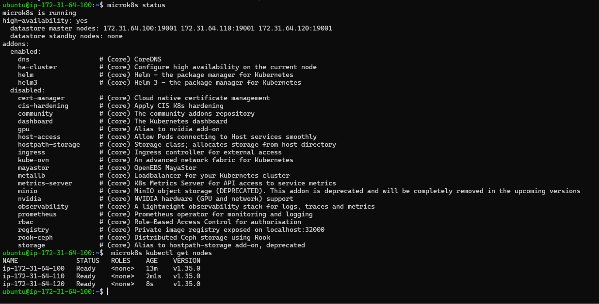
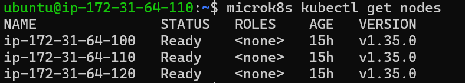
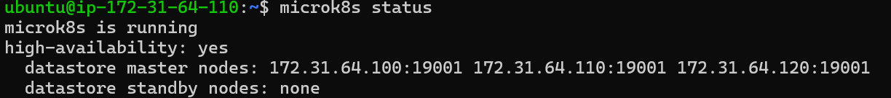
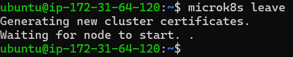
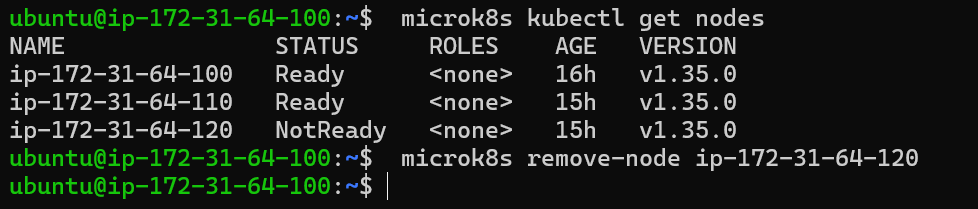
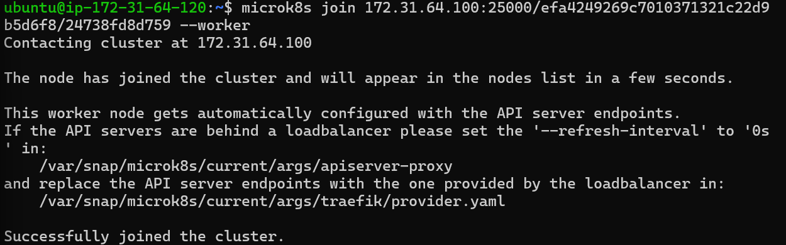
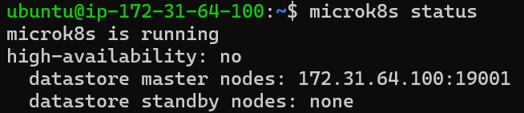
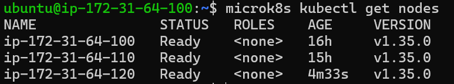
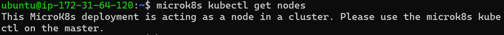

# KN06: Kubernetes I — MicroK8s 3-Node HA-Cluster auf AWS

**Modul 347 – Dienst mit Container anwenden**
**Autor:**Lèon Wolff, David Tarlos

## Inhaltsverzeichnis

- [Setup-Übersicht](#setup-übersicht)
- [Cloud-Init-Datei](#cloud-init-datei)
- [Teil A — Installation](#teil-a--installation)
  - [Server-Anforderungen erfüllt](#server-anforderungen-erfüllt)
  - [Cluster bilden](#cluster-bilden)
  - [Screenshot Teil A](#screenshot-teil-a)
- [Teil B — Verständnis für Cluster](#teil-b--verständnis-für-cluster)
  - [`microk8s` vs `microk8s kubectl`](#microk8s-vs-microk8s-kubectl)
  - [B1: get nodes auf zweiter Node](#b1-get-nodes-auf-zweiter-node)
  - [B2: microk8s status & HA-Erklärung](#b2-microk8s-status--ha-erklärung)
  - [B3: Node entfernen](#b3-node-entfernen)
  - [B4: Re-add als Worker](#b4-re-add-als-worker)
  - [B5: microk8s status nach Worker-Rejoin](#b5-microk8s-status-nach-worker-rejoin)
  - [B6: get nodes auf Master und Worker](#b6-get-nodes-auf-master-und-worker)
- [Hinweis für KN-07](#hinweis-für-kn-07)
- [Abgaben-Checkliste](#abgaben-checkliste)

---

## Setup-Übersicht

Setup gemäss TBZ-AWS-Installationsanleitung:

| Element | Wert |
|---|---|
| Cloud | AWS Academy Learner Lab (us-east-1) |
| Anzahl Instanzen | 3 |
| AMI | Ubuntu Server 24.04 LTS |
| Instance Type | **t2.medium** (2 vCPU, 4 GB RAM) — TBZ-Vorgabe |
| Storage | 30 GB gp3 je Instanz |
| Key Pair | vockey (AWS-managed, `labsuser.pem`) |
| Subnet | spezifisch gewählt, CIDR `172.31.64.0/20` |
| Statische private IPs | über vorab angelegte Network Interfaces: `172.31.64.100` (node1), `172.31.64.110` (node2), `172.31.64.120` (node3) |
| Statische öffentliche IPs | 3× Elastic IPs vorab anlegen und an die ENIs hängen |
| Security Group | Inbound: **All traffic from subnet-CIDR `172.31.64.0/20`** + SSH 22 from anywhere |
| User data | Inhalt von [`cloud-init.yaml`](./cloud-init.yaml) — identisch auf allen 3 VMs |
| Name-Tags | `m347-kn06-node1`, `m347-kn06-node2`, `m347-kn06-node3` |

**SSH-Login** (Beispiel für node1):
```bash
ssh -i labsuser.pem ubuntu@<node1-elastic-ip>
```

---

## Cloud-Init-Datei

Datei: [`cloud-init.yaml`](./cloud-init.yaml) — **1:1 die vom TBZ-Lehrer bereitgestellte `microk8s.yaml`**, ergänzt um einen Slot für Leons eigenen SSH-Pubkey (TBZ verlangt explizit *"eigenen SSH-Key hinzufügen, ohne den bestehenden zu entfernen"*).

```yaml
#cloud-config

users:
  - name: ubuntu
    sudo: ALL=(ALL) NOPASSWD:ALL
    groups: users, admin, microk8s
    home: /home/ubuntu
    shell: /bin/bash
    ssh_authorized_keys:
      - ssh-rsa AAAAB3NzaC1yc2EA...VlOw2pQNri7+04OOfn2FGlqr5 teacher
      # Slot für Leons eigenen Pubkey (oder weglassen — vockey reicht für SSH)

groups:
  - microk8s

system_info:
  default_user:
    groups: [microk8s]

ssh_pwauth: false
disable_root: false

package_update: true
package_upgrade: true

packages:
  - curl

runcmd:
  - sudo snap install microk8s --classic
  - mkdir /home/ubuntu/.kube
```

**Was hier passiert:**

- **`users:`-Block** erstellt/konfiguriert den `ubuntu`-User explizit mit `sudo NOPASSWD`, Gruppe `microk8s` und Lehrer-Pubkey. AWS Academy injiziert zusätzlich automatisch den `vockey` für den `ubuntu`-User — beide Keys greifen.
- **`groups: - microk8s`** und **`system_info.default_user.groups: [microk8s]`** legen die `microk8s`-Gruppe an und sorgen dafür, dass der Default-User ihr angehört — damit `microk8s`-Befehle ohne `sudo` laufen.
- **`ssh_pwauth: false`** — kein Passwort-SSH (Key-only).
- **`package_update`/`package_upgrade: true`** — vor der Installation einmal komplett aktualisieren.
- **`snap install microk8s --classic`** — installiert MicroK8s aus dem Default-Channel (aktuell stable). `--classic` erlaubt dem Snap die nötigen Systemzugriffe.
- **`mkdir /home/ubuntu/.kube`** — vorbereitendes Verzeichnis für kubectl-Configs (später relevant).

---

## Teil A — Installation

### Server-Anforderungen erfüllt

Die TBZ-Anleitung verlangt explizit:

| Anforderung | Umsetzung |
|---|---|
| Statische private IP | Network Interface vorab mit fixer IP (`.100/.110/.120`) angelegt und der Instanz zugewiesen ✓ |
| Statische öffentliche IP | Elastic IP vorab erstellt und an das ENI gehängt ✓ |
| Security Group blockiert keine Node-Kommunikation | Inbound-Regel **"All traffic from `172.31.64.0/20`"** öffnet alles innerhalb des Subnets ✓ |
| Ubuntu | Ubuntu Server 24.04 LTS ✓ |
| ≥ 2 Cores | t2.medium = 2 vCPU ✓ |
| ≥ 4 GB RAM | t2.medium = 4 GB RAM ✓ |
| ≥ 30 GB Disk | 30 GB gp3 ✓ |

### AWS-Setup-Reihenfolge (TBZ-Vorgehen)

1. **Subnet auswählen** im Default-VPC mit CIDR `172.31.64.0/20` (Name notieren)
2. **Security Group** `m347-kn06-cluster` anlegen:
   - Inbound: Custom TCP / All Traffic, Source = `172.31.64.0/20` (Subnet-CIDR)
   - Inbound: SSH 22 from `0.0.0.0/0`
3. **3 Elastic IPs** allozieren (für jede Node eine öffentliche statische IP)
4. **3 Network Interfaces** anlegen (im obigen Subnet) mit fixen privaten IPs:
   - ENI1: `172.31.64.100`
   - ENI2: `172.31.64.110`
   - ENI3: `172.31.64.120`
   - Jeweils unsere Security Group dranhängen
5. **Elastic IP an ENI binden:** jedes ENI bekommt eine der vorab allozierten EIPs
6. **3 EC2-Instanzen** launchen mit identischer Config:
   - AMI: Ubuntu 24.04 LTS
   - Type: t2.medium
   - Storage: 30 GB gp3
   - Key Pair: vockey
   - **Network: existierendes ENI auswählen** (kein neues — sonst greift die fixe IP nicht)
   - User data: Inhalt von `cloud-init.yaml`
   - Name-Tags: `m347-kn06-node1` / `node2` / `node3`

### Cluster bilden

Nach dem Launch der 3 Instanzen warte ich ca. 2–3 Minuten, bis Cloud-Init durch ist (`/var/log/cloud-init-output.log` checken oder direkt `microk8s status --wait-ready`).

**Auf node1 (initialer Master):**
```bash
microk8s add-node
```
Ausgabe enthält einen Join-Befehl, z.B.:
```
microk8s join 172.31.x.x:25000/<token>/<fingerprint>
```

**Auf node2:**
```bash
microk8s join 172.31.x.x:25000/<token>/<fingerprint>
```

Der Token ist **single-use** — also wieder auf **node1**:
```bash
microk8s add-node
```
… und **auf node3** mit dem **neuen** Token:
```bash
microk8s join 172.31.x.x:25000/<neuer-token>/<fingerprint>
```

**Verifikation auf node1:**
```bash
microk8s status
microk8s kubectl get nodes
```

`microk8s status` zeigt `high-availability: yes`, `get nodes` listet alle 3 Nodes als `Ready` mit ROLES `control-plane,worker`.

### Screenshot Teil A



**Was zu sehen ist:**
- `microk8s status` oben: `high-availability: yes` mit 3 datastore master nodes (172.31.64.100/110/120 auf Port 19001) — der Cluster ist hochverfügbar.
- `microk8s kubectl get nodes` unten: Alle 3 Nodes (`ip-172-31-64-100/110/120`) im STATUS `Ready`, Version v1.35.0.

> **Hinweis zur ROLES-Spalte:** MicroK8s 1.35 setzt die Node-Role-Labels nicht standardmäßig, deshalb steht `<none>` statt `control-plane,worker`. Das ist eine Eigenheit von MicroK8s (anders als bei kubeadm-basierten Clustern). Die echte Topologie steht in `microk8s status` — und dort sieht man eindeutig, dass alle 3 Nodes Datastore-Master sind.

Damit ist der HA-Cluster gebildet (Abgabe-Punkt A erfüllt).

---

## Teil B — Verständnis für Cluster

### `microk8s` vs `microk8s kubectl`

In eigenen Worten:

- **`microk8s`** verwaltet die **MicroK8s-Installation selbst** auf der Node. Damit startest/stoppst du den Dienst (`microk8s start/stop`), schaust nach ob er läuft (`microk8s status`), aktivierst Add-ons (`microk8s enable dns`) oder verbindest Nodes zu einem Cluster (`microk8s add-node` / `microk8s join`). Es operiert **auf der Node-Ebene** — also dem Container-Host-System.
- **`microk8s kubectl`** ist das **eingebaute Kubernetes-CLI** (`kubectl`). Es spricht mit dem **Cluster** und verwaltet Kubernetes-Ressourcen (`get pods`, `apply -f deployment.yaml`, `describe deployment`, `logs <pod>`). Es operiert **auf der Cluster-Ebene** — also den Workloads, die im Kubernetes-System laufen.
- **Analogie:** `microk8s` ist die **Box** (das Snap-Paket selbst, die Installation), `microk8s kubectl` ist das **Werkzeug in der Box**, mit dem du die Arbeit innerhalb von Kubernetes machst.

Weil `kubectl` als Subkommando in MicroK8s integriert ist, muss man `microk8s kubectl ...` tippen statt nur `kubectl ...`. Die TBZ-Anleitung schlägt vor, optional einen Alias zu setzen:
```bash
alias kubectl='microk8s kubectl'
```
(z.B. in `~/.bashrc` der Node). In dieser Doku verwende ich konsequent die volle Form `microk8s kubectl ...`, damit klar bleibt, was eigentlich aufgerufen wird.

---

### B1: get nodes auf zweiter Node

SSH auf **node2**, dann:
```bash
microk8s kubectl get nodes
```



**Erklärung:** Das Ergebnis ist **identisch** zur Sicht von node1 — alle 3 Nodes sind Ready. Das funktioniert, weil in einem HA-Cluster **jede Master-Node eine eigene Replica des Kubernetes-API-Servers** läuft. node2 fragt also ihre lokale API-Server-Replica, und die hat dieselben Cluster-Daten wie node1 (dqlite synchronisiert sie). Im HA-Setup gibt es keinen Single Point of Failure für den API-Zugriff.

---

### B2: microk8s status & HA-Erklärung

Auf node1 (oder einer beliebigen Master-Node):
```bash
microk8s status
```



**Die ersten Zeilen vor `addons:` sehen so aus:**

```
microk8s is running
high-availability: yes
  datastore master nodes: 172.31.a.a:19001 172.31.b.b:19001 172.31.c.c:19001
  datastore standby nodes: none
```

**Was das bedeutet:**

- **`microk8s is running`** — der MicroK8s-Dienst auf dieser Node läuft.
- **`high-availability: yes`** — der Cluster ist hochverfügbar. MicroK8s aktiviert HA **automatisch ab 3 Nodes** (in älteren Versionen brauchte es noch `microk8s enable ha-cluster`, heute nicht mehr).
- **`datastore master nodes`** — die Nodes, die eine **Stimme im dqlite-Quorum** haben. Dqlite ist der eingebaute Datenspeicher von MicroK8s (eine verteilte SQLite-Variante mit Raft-Konsens). Diese 3 Nodes speichern die komplette Cluster-State.
- **`datastore standby nodes: none`** — Read-only Replicas. Die gibt's erst bei **mehr als 3 Nodes**; mit genau 3 Master-Nodes ist Standby leer.

**Warum HA?** Wenn eine Master-Node ausfällt, bleiben die anderen 2 von 3 als Quorum übrig (Raft braucht Mehrheit = 2 von 3). Der Cluster wählt automatisch einen neuen Leader und arbeitet weiter, ohne dass Pods abstürzen oder kubectl-Befehle fehlschlagen. Quelle: [MicroK8s High Availability Docs](https://microk8s.io/docs/high-availability).

---

### B3: Node entfernen

Wir entfernen **node3** aus dem Cluster. Dazu sind **zwei Befehle** auf **zwei verschiedenen Nodes** nötig:

**Auf node3 (die Node, die geht):**
```bash
microk8s leave
```

**Auf node1 (Master, säubert die Cluster-Membership):**
```bash
microk8s remove-node <node3-hostname>
```
(Hostname findest du mit `microk8s kubectl get nodes` aus der NAME-Spalte, typisch z.B. `ip-172-31-x-y`.)

**`leave` auf node3:**



**`remove-node` auf node1 (Master), mit `get nodes` davor zur Bestätigung dass node3 NotReady ist:**



**Erklärung — warum braucht es beide Befehle?**

- **`microk8s leave`** ist **clientseitig** auf der ausscheidenden Node — sie räumt ihren lokalen MicroK8s-Zustand auf und tritt aus dem dqlite-Quorum aus.
- **`microk8s remove-node`** ist **serverseitig** auf einem verbleibenden Master — er entfernt den Eintrag der Node aus der Membership-Liste des Clusters. Ohne diesen Schritt würde die Node in `kubectl get nodes` noch als `NotReady` herumdümpeln.

Falls die Node nicht mehr erreichbar ist (z.B. abgestürzt), kann man auf dem Master direkt `microk8s remove-node <name> --force` aufrufen.

---

### B4: Re-add als Worker

**Auf node1 (Master) einen neuen Join-Token erzeugen:**
```bash
microk8s add-node
```

**Auf node3 mit dem `--worker`-Flag joinen:**
```bash
microk8s join 172.31.x.x:25000/<neuer-token>/<fingerprint> --worker
```



**Erklärung — was macht `--worker`?** Standardmässig wird eine joinende Node zu einer vollwertigen **Master-Node** (mit dqlite-Stimme + API-Server-Replica + kann Pods ausführen). Mit `--worker` wird sie zu einer **reinen Worker-Node**: kein dqlite, keine API-Server-Replica, nur das Kubelet zum Ausführen von Pods. Das spart Ressourcen — und genau das demonstriert dieser Schritt.

> **Hinweis zur Auftrags-Formulierung:** Der Auftrag schreibt "Am Ende haben sie einen Cluster mit einer Master-Node und zwei Worker-Nodes". Tatsächlich entsteht aber ein Cluster mit **2 Master-Nodes (node1, node2) und 1 Worker-Node (node3)** — wir haben ja nur **eine** Node entfernt und als Worker re-joined. Die anderen zwei Master sind unverändert geblieben. Diese Topologie reicht aus, um den HA-Effekt (siehe B5) zu demonstrieren.

---

### B5: microk8s status nach Worker-Rejoin

Auf node1:
```bash
microk8s status
```



**Die ersten Zeilen sehen jetzt so aus:**

```
microk8s is running
high-availability: no
  datastore master nodes: 172.31.64.100:19001
  datastore standby nodes: none
```

**Unterschied zu B2 und woher er kommt:**

- Vorher (B2): `high-availability: yes`, **3 datastore master nodes** → HA aktiv, Quorum aus 3 Stimmen.
- Jetzt (B5): `high-availability: no`, **nur noch 1 datastore master node** → HA komplett weg.

**Warum nur 1 Master, obwohl noch 2 Master-fähige Nodes (node1, node2) übrig sind?** Dqlite (das verteilte Datastore-Backend) braucht für ein funktionierendes Raft-Quorum **mindestens 3 Voting-Members**. Mit 2 Voting-Members wäre Quorum unentscheidbar (kein klarer Mehrheits-Beschluss bei 1-zu-1). MicroK8s reagiert deshalb radikal: sobald < 3 Master-Nodes übrig sind, schaltet es auf **Single-Master-Modus** zurück — nur node1 bleibt aktiver Datastore-Master, node2 läuft als Cluster-Mitglied weiter, ist aber kein dqlite-Voter mehr.

Wichtige Lehre: **`--worker`-Nodes zählen NICHT als Master/Voter** für HA. node3 ist zwar wieder im Cluster, trägt aber nichts zur Hochverfügbarkeit bei. HA in MicroK8s = **drei vollwertige Master**; sobald wir auch nur eine Master-Node durch einen Worker ersetzen, kollabiert die HA-Topologie.

---

### B6: get nodes auf Master und Worker

**Auf node1 (Master):**
```bash
microk8s kubectl get nodes
```



**Auf node3 (Worker):**
```bash
microk8s kubectl get nodes
```



**Was zu sehen ist — zwei verschiedene Resultate:**

- **Auf node1 (Master):** Alle 3 Nodes Ready, alle ROLES `<none>` (MicroK8s 1.35 setzt keine Role-Labels automatisch — die echte Topologie steht in `microk8s status`, nicht in der ROLES-Spalte).
- **Auf node3 (Worker):** Fehlermeldung statt Nodes-Liste:
  > `This MicroK8s deployment is acting as a node in a cluster. Please use the microk8s kubectl on the master.`

**Was bedeutet das?** Eine Worker-Node (mit `--worker` gejoined) hat **keinen lokalen Kubernetes-API-Server**. Sie hat nur das Kubelet, das Pods ausführt, wenn der Master sie hier hin scheduled. kubectl spricht aber immer mit dem API-Server — und den findet sie lokal nicht, also bricht sie ab und verweist auf den Master.

**Konsistenz mit B5 erklärt:**

- B5 (`microk8s status`) sagte: `high-availability: no`, nur noch 1 datastore master.
- B6 zeigt das aus zwei anderen Perspektiven:
  - Master-Sicht: `get nodes` läuft, sieht 3 Nodes — der API-Server kennt die ganze Cluster-Membership.
  - Worker-Sicht: `get nodes` läuft gar nicht — bestätigt, dass diese Node kein eigener Master mehr ist (also auch nicht zur HA beiträgt).

Beide Symptome erzählen dieselbe Geschichte wie B5: **node3 ist im Cluster, aber ohne Control-Plane-Rolle** — keine API-Server-Replica, kein dqlite-Vote. Genau deshalb ist HA weg.

**Vergleich zu B1:** Damals (im 3-Master-Setup) konnte jede der drei Nodes `kubectl get nodes` ausführen, weil jede einen API-Server hatte. Jetzt geht das nur noch auf node1/node2 (Master). Das ist der greifbare Unterschied zwischen vollwertiger Master-Node und reiner Worker-Node.

---

## Hinweis für KN-07

Dieser Cluster wird in **KN-07 weiterverwendet** — daher:

- AWS Academy Lab **nicht** "End Lab" drücken bis KN-07 fertig ist
- Wenn das Lab abläuft und neu gestartet wird: Instanzen sind gestoppt, die Cluster-Membership überlebt aber (dqlite persistiert auf Disk). Nach Restart: neue Public IPs notieren, private IPs bleiben i.d.R. stabil. Cluster sollte mit `microk8s start` auf jeder Node wieder hochkommen.

---

## Abgaben-Checkliste

**Teil A — Installation (50 %)**
- [x] Cluster mit 3 Nodes auf AWS via TBZ-Anleitung (MicroK8s + cloud-init)
- [x] Server-Anforderungen erfüllt (statische IPs, SG offen, Ubuntu, 2C/4G/30G)
- [x] Screenshot `microk8s kubectl get nodes` mit allen 3 Nodes als HA-Cluster verbunden (`kn06-nodes-master.png`)

**Teil B — Verständnis für Cluster (50 %)**
- [x] Erklärung `microk8s` vs `microk8s kubectl` in eigenen Worten
- [x] B1: `microk8s kubectl get nodes` auf 2. Node mit Screenshot (`kn06-nodes-node2.png`) und Erklärung
- [x] B2: `microk8s status` mit Screenshot (`kn06-status-ha.png`) und Erklärungstext zu HA / dqlite / Quorum
- [x] B3: Node entfernen — Befehle (`leave` + `remove-node`) mit Screenshots (`kn06-remove-node-leave.png`, `kn06-remove-node-master.png`)
- [x] B4: `--worker` rejoin mit Screenshot (`kn06-rejoin-worker.png`)
- [x] B5: `microk8s status` erneut mit Screenshot (`kn06-status-after-worker.png`) und Erklärung warum HA verloren
- [x] B6: `microk8s kubectl get nodes` auf Master und Worker mit beiden Screenshots (`kn06-nodes-master-after.png`, `kn06-nodes-worker-after.png`) und Konsistenz-Erklärung zu B5
