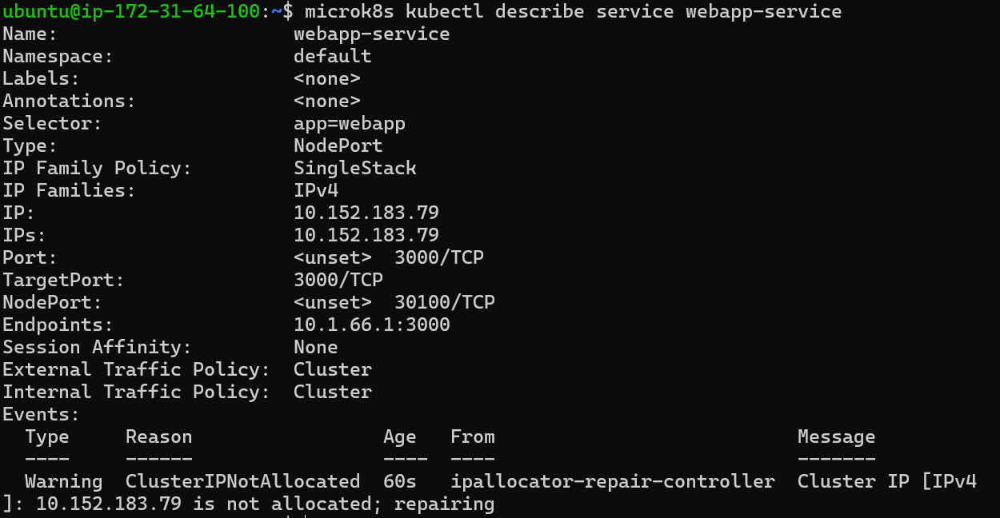
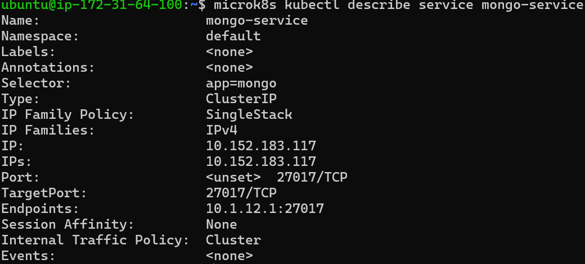
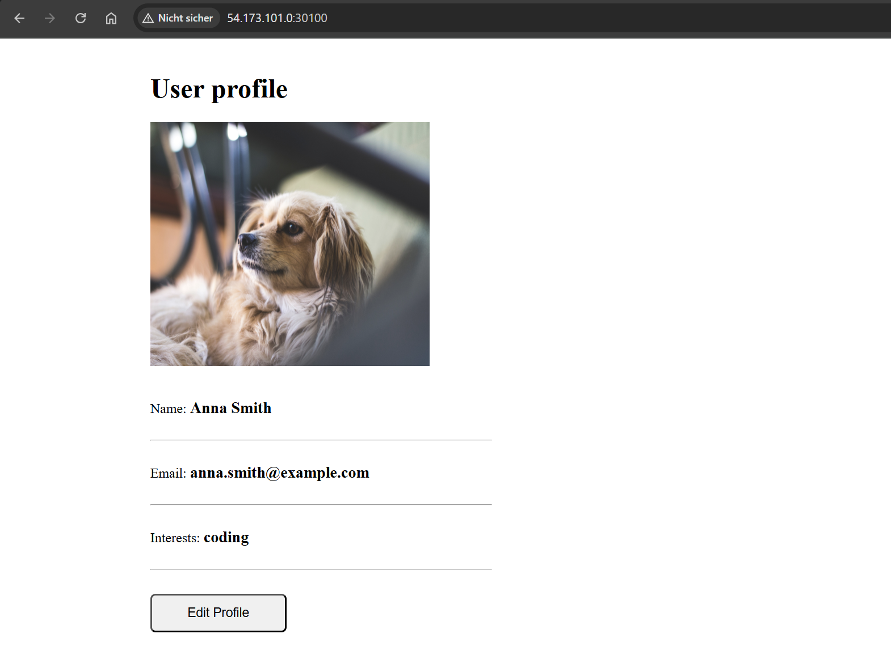
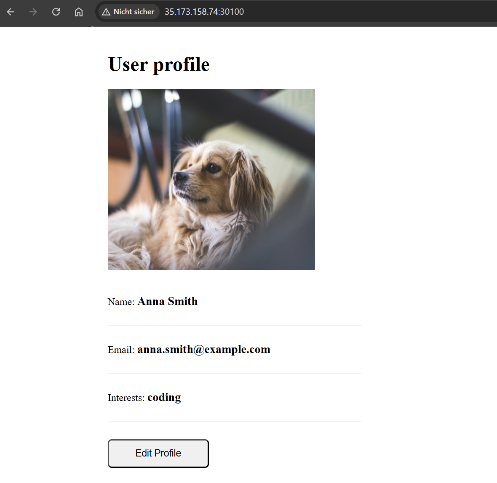
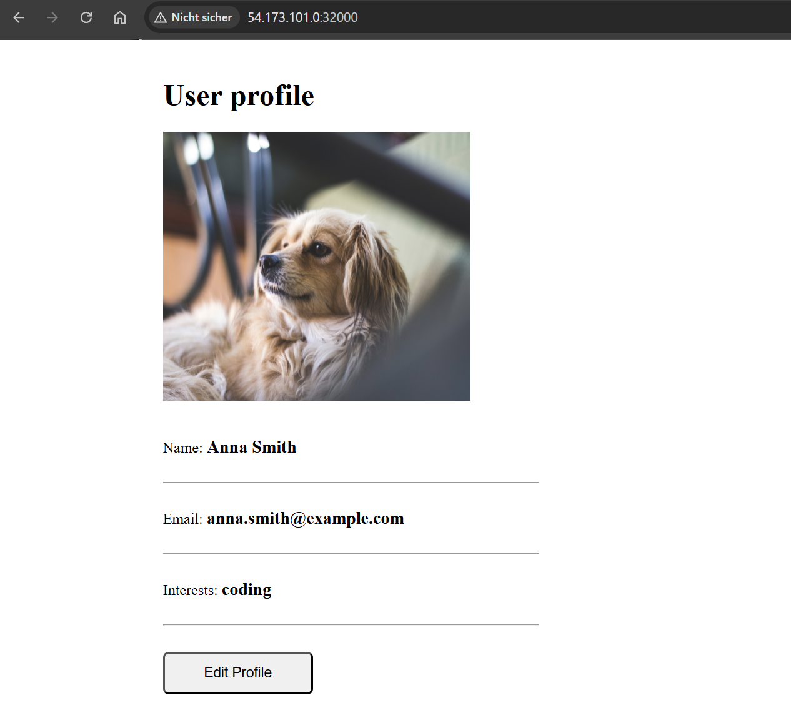
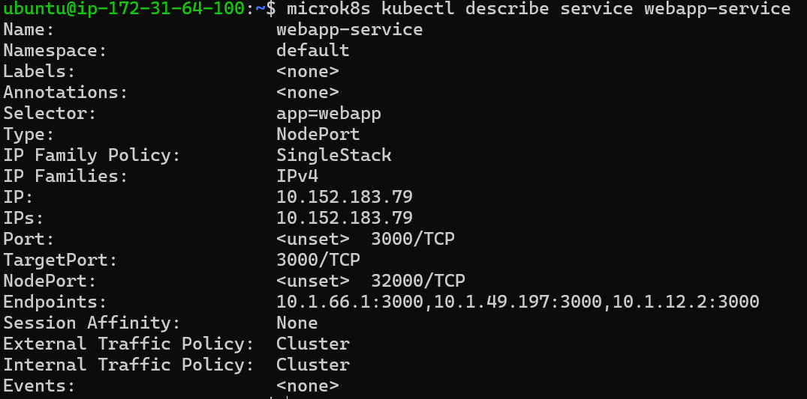

# KN07: Kubernetes II — Demo Project auf MicroK8s-Cluster

**Modul 347 – Dienst mit Container anwenden**
**Autor:** Leon Wulff

## Inhaltsverzeichnis

- [Setup-Übersicht](#setup-übersicht)
- [Teil A — Begriffe und Konzepte](#teil-a--begriffe-und-konzepte)
  - [A1: Pods vs Replicas](#a1-pods-vs-replicas)
  - [A2: Service vs Deployment](#a2-service-vs-deployment)
  - [A3: Welches Problem löst Ingress?](#a3-welches-problem-löst-ingress)
  - [A4: Wofür ist ein StatefulSet?](#a4-wofür-ist-ein-statefulset)
- [Teil B — Demo Project](#teil-b--demo-project)
  - [Architektur-Übersicht](#architektur-übersicht)
  - [YAML-Files](#yaml-files)
  - [Deployment auf den Cluster](#deployment-auf-den-cluster)
  - [B-Q1: Welcher Service nicht wie im Tutorial?](#b-q1-welcher-service-nicht-wie-im-tutorial-umgesetzt)
  - [B-Q2: Wieso ist `mongo-url: mongo-service` korrekt?](#b-q2-wieso-ist-mongo-url-mongo-service-korrekt)
  - [B-Q3: `describe service webapp-service` auf 2 Nodes](#b-q3-describe-service-webapp-service-auf-2-nodes)
  - [B-Q4: `describe service mongo-service` — Unterschiede](#b-q4-describe-service-mongo-service--unterschiede)
  - [B-Q5: Webseite aufrufen — von 2 Nodes](#b-q5-webseite-aufrufen--von-2-nodes)
  - [B-Q6: MongoDB Compass — warum klappt's nicht?](#b-q6-mongodb-compass--warum-klappts-nicht)
  - [B-Q7: Modifikation (NodePort 32000, 3 Replicas)](#b-q7-modifikation-nodeport-32000-3-replicas)
- [Abgaben-Checkliste](#abgaben-checkliste)

---

## Setup-Übersicht

Cluster aus [KN-06](../KN-06/KN-06.md) weitergenutzt:

| Element | Wert |
|---|---|
| Cluster | 3 EC2-Nodes auf AWS Academy (us-east-1f) |
| Topologie | 2 Master (node1 + node2) + 1 Worker (node3) — siehe KN-06 B5 |
| MicroK8s | v1.35.0 (CoreDNS + ha-cluster Addons aktiv) |
| Node-IPs (privat) | 172.31.64.100 / .110 / .120 |
| Node-IPs (EIP) | 54.173.101.0 / 35.173.158.74 / 54.158.8.229 |
| Security Group | `m347-kn06-cluster` — **erweitert** um Inbound TCP `30100,32000` from `0.0.0.0/0` (für NodePort-Browserzugriff) |

**Wichtig:** kubectl-Befehle nur auf Master-Nodes (node1, node2). Worker (node3) hat keinen lokalen API-Server und liefert nur die Fehlermeldung "Please use the microk8s kubectl on the master" (siehe KN-06 B6).

---

## Teil A — Begriffe und Konzepte

### A1: Pods vs Replicas

Ein **Pod** ist die kleinste deploybare Einheit in Kubernetes — eine "Hülle" um einen oder mehrere Container, die sich Netzwerk-Namespace und Storage teilen. Auf einem Pod laufen typischerweise *ein* Hauptcontainer plus evtl. Sidecars (z.B. Logging-Agent). Pods sind **ephemer**: sie können jederzeit sterben und neu erstellt werden, dabei wechselt ihre IP-Adresse.

Eine **Replica** ist hingegen kein eigenständiges Objekt, sondern eine **Zahl**: die Anzahl gleichartiger Pod-Kopien, die im Cluster laufen sollen. Verwaltet wird das durch einen **ReplicaSet** (meist automatisch durch ein Deployment). Setze ich `replicas: 3`, sorgt das ReplicaSet dafür, dass **immer genau 3 Pod-Instanzen** des gleichen Blueprints laufen — fällt einer aus, wird sofort ein neuer gestartet.

**Kurz:** Pod = eine konkrete laufende Instanz; Replica = die *Anzahl* dieser Instanzen, die der Cluster aufrechterhalten soll.

### A2: Service vs Deployment

Ein **Deployment** beschreibt, **WAS** läuft: welche Container-Images, mit welchen Env-Variablen, in welcher Anzahl (Replicas), wie bei Updates rolling-out wird. Es erstellt und überwacht ReplicaSets, die wiederum Pods erstellen.

Ein **Service** beschreibt, **WIE** man die laufenden Pods erreicht: er bündelt mehrere Pods (per Label-Selector) hinter **einer stabilen Cluster-IP und einem DNS-Namen** und verteilt eingehende Anfragen darauf (Load-Balancing). Weil Pod-IPs bei jedem Restart wechseln, wäre direkter Zugriff auf Pods unbrauchbar — der Service-Endpunkt bleibt stabil.

**Kurz:** Deployment = der Workload selbst. Service = der Netzwerk-Anschluss zum Workload.

### A3: Welches Problem löst Ingress?

Ohne Ingress muss man für jeden externen Service entweder einen **NodePort** (klobig: ungewöhnlich hohe Ports wie 30100, ein freier Port pro Service) oder einen **LoadBalancer** (teuer in der Cloud: jeder LB kostet Geld + eine eigene öffentliche IP) verwenden. Das skaliert nicht und kann kein HTTP-Routing (nur reine TCP-Weiterleitung).

**Ingress** löst das, indem es **EIN HTTP/HTTPS-Reverse-Proxy-Eingangstor** für *alle* Services im Cluster bildet. Eine Ingress-Konfiguration sagt: `api.example.com/foo` → Service A, `app.example.com` → Service B, `admin.example.com/secure` → Service C — alles über **eine einzige öffentliche IP und einen einzigen LoadBalancer** davor. Zusätzlich kann der Ingress-Controller zentral TLS-Zertifikate verwalten (z.B. via cert-manager).

**Kurz:** Ingress = ein Reverse-Proxy für viele Services statt vielen NodePorts/LoadBalancers; ermöglicht Host-/Pfad-basiertes HTTP-Routing und zentrale TLS-Terminierung.

### A4: Wofür ist ein StatefulSet?

Ein **StatefulSet** ist für Workloads, die **persistente, stabile Identität** brauchen — anders als ein Deployment, wo Pods austauschbar sind. StatefulSet-Pods haben:

- **Stabile, geordnete Namen:** `myapp-0`, `myapp-1`, `myapp-2` — bleiben bei Pod-Restart gleich
- **Stabile Netzwerk-Hostnames:** jeder Pod hat einen eigenen DNS-Eintrag (`myapp-0.myapp-headless.default.svc.cluster.local`)
- **Persistente Volumes pro Pod:** jeder Pod kriegt sein eigenes PersistentVolumeClaim — der State bleibt auch wenn der Pod neu gestartet wird
- **Geordnetes Start/Stop-Verhalten:** Pod-0 startet vor Pod-1 vor Pod-2; beim Skalieren rückwärts wird zuerst Pod-2 gestoppt

**Beispiel (Nicht-DB): Apache Kafka mit Zookeeper.** Ein Kafka-Cluster besteht aus mehreren Brokern, die jeweils eine feste Broker-ID brauchen (`broker.id=0/1/2`), ihren eigenen Storage für die Partition-Logs haben und in einer bestimmten Reihenfolge starten müssen (Zookeeper-Quorum vor Kafka). Wenn Broker-1 neu startet, muss er wieder mit derselben ID und denselben Topic-Daten zurückkommen — sonst ist die Replikation kaputt. Genau das leistet ein StatefulSet.

**Andere typische Nicht-DB-Beispiele:** Elasticsearch-Cluster (Shard-Allocation per Node-ID), Redis Sentinel (Master/Replica-Topologie), RabbitMQ-Cluster (eindeutige Node-Namen im Cluster).

---

## Teil B — Demo Project

### Architektur-Übersicht

```
   ┌─────────────────────────── Cluster ───────────────────────────┐
   │                                                                │
   │   Browser/User                                                 │
   │       │                                                        │
   │       │ HTTP :30100 (NodePort)                                 │
   │       ▼                                                        │
   │   ┌─────────────────┐                                          │
   │   │ webapp-service  │  (Type: NodePort)                        │
   │   │   :3000         │                                          │
   │   └────────┬────────┘                                          │
   │            │                                                   │
   │            ▼                                                   │
   │   ┌─────────────────┐    DB_URL=mongo-url    ┌──────────────┐  │
   │   │ webapp-pod      │  (aus ConfigMap)  ───► │ mongo-service│  │
   │   │ k8s-demo-app    │  USER/PWD (Secret)     │   :27017     │  │
   │   │ :3000           │                        │ (ClusterIP)  │  │
   │   └─────────────────┘                        └──────┬───────┘  │
   │                                                     │          │
   │                                                     ▼          │
   │                                              ┌──────────────┐  │
   │                                              │ mongo-pod    │  │
   │                                              │  mongo:6     │  │
   │                                              │  :27017      │  │
   │                                              └──────────────┘  │
   └────────────────────────────────────────────────────────────────┘
```

Die WebApp ist von aussen via NodePort 30100 erreichbar. Intern spricht sie über den `mongo-service` (ClusterIP, nur cluster-intern) mit dem MongoDB-Pod. ConfigMap liefert die DB-URL, Secret die Credentials.

### YAML-Files

Alle vier YAMLs im Ordner `KN-07/`:

**`mongo-config.yaml`** ([Datei](./mongo-config.yaml)) — ConfigMap mit der DB-URL:
```yaml
apiVersion: v1
kind: ConfigMap
metadata:
  name: mongo-config
data:
  mongo-url: mongo-service
```

**`mongo-secret.yaml`** ([Datei](./mongo-secret.yaml)) — Secret mit DB-Credentials (base64):
```yaml
apiVersion: v1
kind: Secret
metadata:
  name: mongo-secret
type: Opaque
data:
  mongo-user: bW9uZ291c2Vy            # base64 "mongouser"
  mongo-password: bW9uZ29wYXNzd29yZA== # base64 "mongopassword"
```

**`mongo.yaml`** ([Datei](./mongo.yaml)) — MongoDB Deployment (1 Replica) + internal Service (ClusterIP, 27017). Auszug:
```yaml
# Deployment:
#   image: mongo:6, port 27017, 1 replica
#   env aus mongo-secret: MONGO_INITDB_ROOT_USERNAME + MONGO_INITDB_ROOT_PASSWORD
# ---
# Service:
#   name: mongo-service
#   type: (default = ClusterIP)
#   port 27017 -> targetPort 27017
#   selector: app=mongo
```

**`webapp.yaml`** ([Datei](./webapp.yaml)) — WebApp Deployment (1 Replica) + NodePort-Service (30100→3000):
```yaml
# Deployment:
#   image: nanajanashia/k8s-demo-app:v1.0, port 3000, 1 replica
#   env: DB_URL (aus ConfigMap), USER_NAME + USER_PWD (aus Secret)
# ---
# Service:
#   name: webapp-service
#   type: NodePort
#   port 3000 -> targetPort 3000, nodePort 30100
#   selector: app=webapp
```

### Deployment auf den Cluster

Auf node1 (Master) per SSH:

```bash
microk8s kubectl apply -f mongo-config.yaml   # ConfigMap zuerst
microk8s kubectl apply -f mongo-secret.yaml   # Secret zuerst
microk8s kubectl apply -f mongo.yaml          # MongoDB (braucht Secret)
microk8s kubectl apply -f webapp.yaml         # WebApp (braucht ConfigMap + Secret)
microk8s kubectl get all                      # Verifikation
```

`get all` zeigt: 2 Deployments, 2 ReplicaSets, 2 Pods (je 1 für mongo + webapp), 2 Services + kubernetes-Default.

### B-Q1: Welcher Service nicht wie im Tutorial umgesetzt?

Die **MongoDB** ist als **Deployment** definiert (siehe `mongo.yaml`), konzeptionell wäre aber ein **StatefulSet** richtig — Datenbanken sind genau der Standardfall für StatefulSets (siehe [A4](#a4-wofür-ist-ein-statefulset)).

**Warum macht das TBZ-Tutorial es trotzdem als Deployment?**

1. **Nur 1 Replica:** kein Skalierungs-Bedarf in der Demo — kein StatefulSet-Vorteil
2. **Kein PersistentVolume definiert:** der Pod hat nur Container-Memory. Beim Pod-Restart verschwinden die Daten sowieso → die persistente Identität, die ein StatefulSet bieten würde, hat hier nichts zu speichern
3. **Demo-Vereinfachung:** ein StatefulSet braucht zusätzlich PersistentVolumeClaim-Templates, einen Headless-Service, mehr Konzepte für Lernende
4. **In Produktion zwingend StatefulSet:** dort braucht jede DB-Instanz dauerhaftes Storage, sonst sind alle gespeicherten Daten beim Pod-Crash weg

Kurz: Es ist eine **bewusste Vereinfachung für die Demo**, technisch funktioniert es, aber für echte Workloads wäre StatefulSet (mit PVC) Pflicht.

### B-Q2: Wieso ist `mongo-url: mongo-service` korrekt?

In der ConfigMap steht als URL einfach der String `mongo-service` — ohne Protokoll, ohne IP, ohne Port. Funktioniert trotzdem, weil Kubernetes ein eingebautes **Service-DNS** über CoreDNS bereitstellt:

- Jedes Service-Objekt im Cluster ist unter seinem **`metadata.name`** als DNS-Hostname auflösbar
- In `mongo.yaml` heisst der Service genau `mongo-service` (siehe `metadata.name`)
- Wenn die WebApp innerhalb des Clusters `mongo-service` anfragt, löst CoreDNS das automatisch zur **Cluster-IP** des Services auf
- Der Service routet die Anfrage dann an einen Pod mit `app: mongo`-Label auf Port 27017

**Vorteile:**
- Kein hardcoded IP — funktioniert auch wenn die Pod-IP nach Restart wechselt
- Funktioniert über alle Nodes hinweg (Cluster-DNS ist global)
- Wenn ich später Replicas hochfahre, regelt der Service automatisch Load-Balancing

**Voller FQDN wäre:** `mongo-service.default.svc.cluster.local` (Namespace + svc-Suffix), aber innerhalb des gleichen Namespace reicht der Kurzname.

### B-Q3: `describe service webapp-service` auf 2 Nodes

Auf **node1** ausgeführt:



Auf **node2** ausgeführt:


**Ergebnis:** Beide Ausgaben sind identisch — gleicher Service-Name, gleicher Type (NodePort), gleicher Port (3000), gleicher NodePort (30100), gleiche Endpoints (Pod-IP:3000).

**Warum?** node1 und node2 sind beide Master-Nodes mit einer **eigenen API-Server-Replica**. Beide Replicas teilen sich dieselbe Cluster-State (über dqlite — siehe KN-06 B2). Egal welchen Master ich frage, ich bekomme dasselbe Bild des Clusters zurück. Das ist genau der Zweck eines verteilten Control-Planes.

### B-Q4: `describe service mongo-service` — Unterschiede

Auf node1:



**Unterschiede zur `describe webapp-service`-Ausgabe:**

| Feld | webapp-service | mongo-service |
|---|---|---|
| **Type** | `NodePort` | `ClusterIP` (default) |
| **NodePort** | `30100/TCP` (Zeile vorhanden) | Feld komplett **nicht aufgeführt** |
| **External-Sicht** | über jede Node-IP:30100 erreichbar | nur cluster-intern erreichbar |
| **Endpoints** | webapp-Pod-IP:3000 | mongo-Pod-IP:27017 |

**Grund für die Unterschiede:** `webapp-service` muss **von aussen** erreichbar sein (Browser-User) → `type: NodePort` setzt das um. `mongo-service` braucht nur cluster-internen Zugriff (nur die WebApp spricht mit der DB) → der Default `ClusterIP` reicht und ist sicherer, weil die DB nicht direkt aus dem Internet erreichbar ist.

### B-Q5: Webseite aufrufen — von 2 Nodes

**Wie funktioniert's?** Die WebApp ist als NodePort-Service deployed. MicroK8s mapt NodePort-Services automatisch auf **alle** Nodes des Clusters — also kann ich die Webseite über die öffentliche IP **jeder** Node mit Port 30100 erreichen.

**Voraussetzung:** Security Group `m347-kn06-cluster` muss Port 30100 von extern zulassen (Standardmässig war nur SSH 22 + Subnet-intern offen — wurde für KN-07 ergänzt).

**Aufruf:** `http://<node-public-ip>:30100`

Beweis über zwei verschiedene Nodes:





Beide URLs liefern dieselbe Seite, weil Kubernetes intern den Request an einen passenden webapp-Pod routet (egal auf welcher Node der Pod tatsächlich läuft). Das ist die Magie des NodePort + kube-proxy: jede Node fängt Anfragen auf NodePort ab und leitet sie cluster-intern weiter.

### B-Q6: MongoDB Compass — warum klappt's nicht?

**Warum scheitert der Verbindungsversuch von MongoDB Compass auf Leons PC?**

`mongo-service` ist vom Type **`ClusterIP`** — nur innerhalb des Clusters routbar. Vom externen PC erreicht keine Anfrage den Service:

- Es gibt keinen NodePort, der den DB-Port 27017 nach aussen mapt
- Es gibt keine LoadBalancer-IP
- Die ClusterIP ist eine virtuelle IP nur innerhalb des Cluster-Netzes (typisch `10.152.x.x` bei MicroK8s)

**Was müsste man am Service ändern, damit Compass verbinden kann?**

`mongo-service` im File `mongo.yaml` von ClusterIP auf NodePort umstellen und einen Port wählen (z.B. 30200):

```yaml
apiVersion: v1
kind: Service
metadata:
  name: mongo-service
spec:
  type: NodePort                    # NEU
  selector:
    app: mongo
  ports:
    - protocol: TCP
      port: 27017
      targetPort: 27017
      nodePort: 30200               # NEU
```

Dann (nach `kubectl apply` und SG-Öffnung von Port 30200):
- Compass-Connection-String: `mongodb://mongouser:mongopassword@<node-eip>:30200`

**⚠️ Achtung — Sicherheits-Warnung:** das ist **nur für die Demo akzeptabel**. In Produktion sollte eine DB **nie** direkt aus dem Internet erreichbar sein — Brute-Force-Risiko, Datenleck-Risiko. Stattdessen:
- VPN/Private Network zur DB
- SSH-Tunnel zur DB (`ssh -L 27017:mongo-service:27017 ...`)
- Bastion-Host mit limitiertem Zugriff

### B-Q7: Modifikation (NodePort 32000, 3 Replicas)

**Was zu tun:** WebApp-Service auf NodePort `32000` (statt 30100) ändern UND `replicas` auf `3` (statt 1) hochsetzen.

**Schritte:**

1. **Neue YAML-Version erstellen:** [`webapp-final.yaml`](./webapp-final.yaml) — Kopie von `webapp.yaml` mit `replicas: 3` und `nodePort: 32000`.

2. **SG erweitern:** Inbound TCP 32000 von 0.0.0.0/0 (analog zu 30100).

3. **Re-Deploy mit `kubectl apply`:** auf node1:
   ```bash
   microk8s kubectl apply -f webapp-final.yaml
   ```
   `apply` ist **idempotent** — es vergleicht die neuen YAML-Definitionen mit der laufenden State und macht nur die Differenz:
   - Deployment: `replicas: 1` → `3` → ReplicaSet skaliert hoch → 2 neue Pods werden gestartet
   - Service: ändert `nodePort: 30100` → `32000` → kube-proxy aktualisiert seine iptables-Regeln

4. **Verifikation:**
   ```bash
   microk8s kubectl get pods -o wide     # 3 webapp-Pods (vermutlich je 1 pro Node)
   microk8s kubectl describe service webapp-service
   ```

5. **Browser-Test:** `http://<node-eip>:32000`

   

6. **Endpoints-Verifikation:**

   

**Unterschied bei den Replicas im describe-Output:** Das Feld `Endpoints:` listet jetzt **3 IP:Port-Paare** statt vorher 1 (eines pro Pod). Der Service load-balanced eingehende Anfragen round-robin auf alle 3 Pods.

```
Endpoints:    10.1.x.a:3000,10.1.y.b:3000,10.1.z.c:3000
```

(vorher: nur **eine** IP:Port-Zeile)

---

## Abgaben-Checkliste

**Teil A — Begriffe (40 %)**
- [x] A1: Unterschied Pods vs Replicas in eigenen Worten
- [x] A2: Unterschied Service vs Deployment in eigenen Worten
- [x] A3: Welches Problem löst Ingress? In eigenen Worten
- [x] A4: Wofür ist ein StatefulSet? In eigenen Worten — mit Nicht-DB-Beispiel (Kafka)

**Teil B — Demo Project (60 %)**
- [x] Demo Project auf 3-Node-Cluster deployt (ConfigMap, Secret, MongoDB, WebApp)
- [x] B-Q1: Begründung warum MongoDB als Deployment statt StatefulSet umgesetzt ist
- [x] B-Q2: Erklärung warum `mongo-url: mongo-service` korrekt ist (Service-DNS)
- [x] B-Q3: `describe service webapp-service` auf 2 Nodes mit Screenshots (`kn07-describe-webapp-node1.png`, `kn07-describe-webapp-node2.png`)
- [x] B-Q4: `describe service mongo-service` Screenshot (`kn07-describe-mongo.png`) + Unterschieds-Erklärung
- [x] B-Q5: Webseite aufrufen + erklären wie + 2 Screenshots von 2 verschiedenen Node-IPs (`kn07-webapp-browser-node1.png`, `kn07-webapp-browser-node2.png`)
- [x] B-Q6: Warum scheitert MongoDB Compass + was müsste am Service geändert werden
- [x] B-Q7: Modifikation auf NodePort 32000 + 3 Replicas, Schritte erklärt + 2 Screenshots (`kn07-webapp-final-browser.png`, `kn07-describe-webapp-final.png`), Replica-Unterschied im describe-Output erklärt
