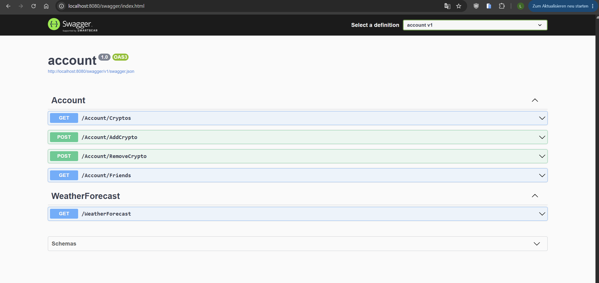
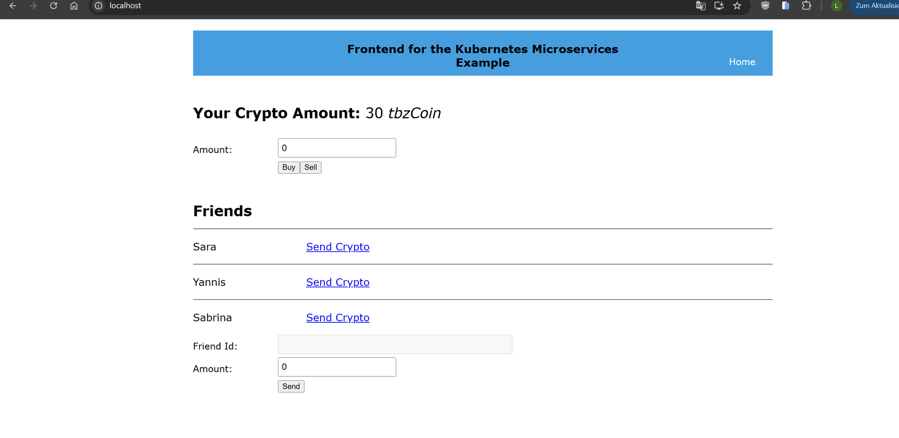
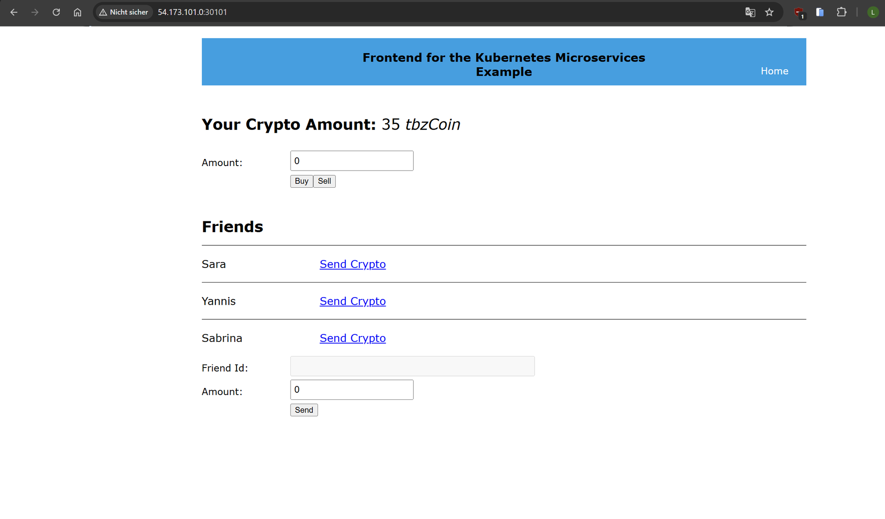
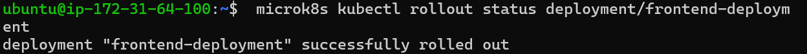
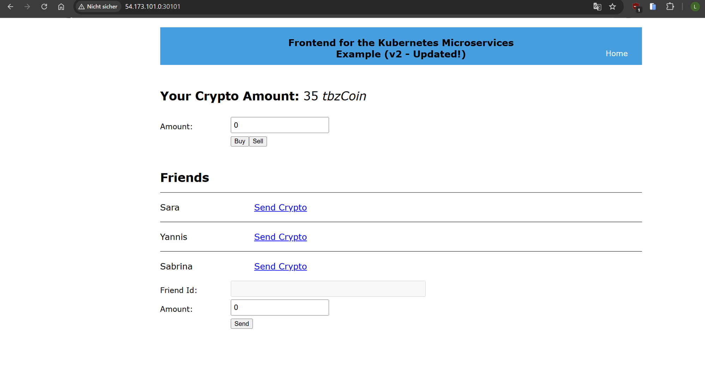
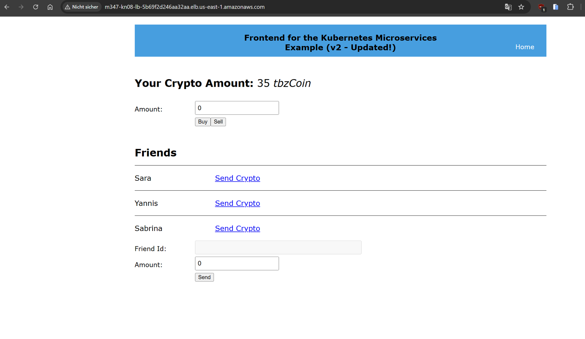
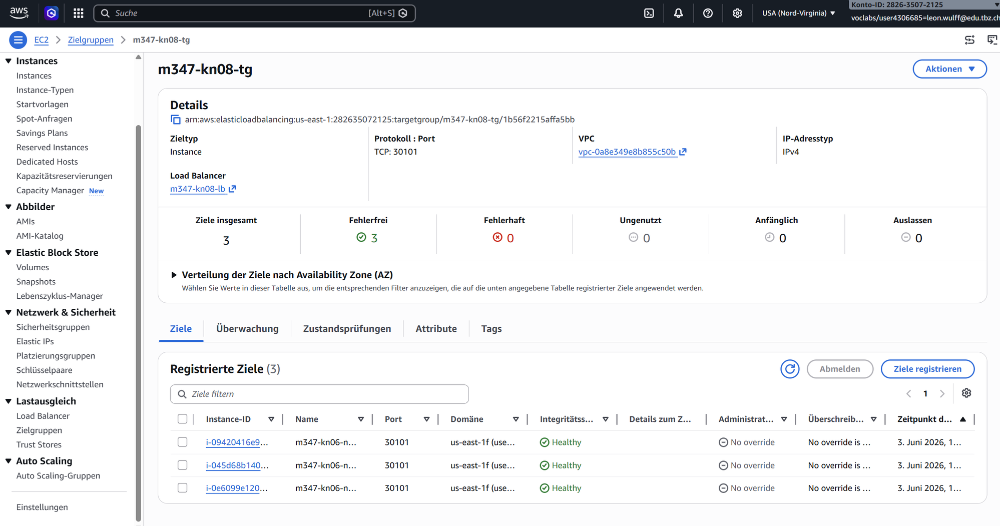

# KN08: Kubernetes III — Crypto Microservices

**Modul 347 – Dienst mit Container anwenden**
**Autor:** Leon Wulff

## Inhaltsverzeichnis

- [Architektur-Übersicht](#architektur-übersicht)
- [Komponenten + Tech-Stack](#komponenten--tech-stack)
- [Aufgabe 1 — Datenbank (AWS RDS MariaDB)](#aufgabe-1--datenbank-aws-rds-mariadb)
- [Aufgabe 2 — Frontend](#aufgabe-2--frontend)
- [Aufgabe 3 — Account-Komponente](#aufgabe-3--account-komponente)
- [Aufgabe 4/5 — Lokaler Docker-Desktop-Test](#aufgabe-45--lokaler-docker-desktop-test)
- [Aufgabe 6 — BuySell + SendReceive implementieren (20%)](#aufgabe-6--buysell--sendreceive-implementieren-20)
- [Aufgabe 7 — Kubernetes Deployment (30%)](#aufgabe-7--kubernetes-deployment-30)
- [Aufgabe 8 — App Update / Rolling Deploy (10%)](#aufgabe-8--app-update--rolling-deploy-10)
- [Aufgabe 9 — Multistage Dockerfile + Dynamic ENV (20%)](#aufgabe-9--multistage-dockerfile--dynamic-env-20)
- [Aufgabe 10 — AWS LoadBalancer (20%)](#aufgabe-10--aws-loadbalancer-20)
- [Abgaben-Checkliste](#abgaben-checkliste)

---

## Architektur-Übersicht

```
                            Internet User
                                  │
                                  │ HTTP :80
                                  ▼
                ┌─────────────────────────────────┐
                │   AWS Network Load Balancer     │   Aufgabe 10
                │   m347-kn08-lb-...elb.aws.com   │
                └────────────────┬────────────────┘
                                 │ NodePort 30101 (TCP)
                                 ▼
   ┌─────────────────────── K8s Cluster (3 Nodes) ────────────────────┐
   │                                                                   │
   │   ┌───────────────────────────────┐                              │
   │   │ frontend-deployment (2x)      │  React + nginx                │
   │   │ Service: NodePort 30101       │  Multistage Image (Aufg. 9)   │
   │   └─────────┬─────────────────────┘  ENV aus ConfigMap (Aufg. 9)  │
   │             │                                                     │
   │       Browser-XHR via NodePorts                                   │
   │             │                                                     │
   │   ┌─────────▼───────┐  ┌─────────────────┐ ┌──────────────────┐ │
   │   │ account-service │  │ buysell-service │ │sendreceive-svc   │ │
   │   │ NodePort 30100  │  │ NodePort 30102  │ │NodePort 30103    │ │
   │   │ .NET 8 / 8080   │  │ Node.js / 8002  │ │Node.js / 8003    │ │
   │   └─────────┬───────┘  └────────┬────────┘ └────────┬─────────┘ │
   │             │                   │ ACCOUNT_URL       │ACCOUNT_URL │
   │             │                   └─────────┬─────────┘            │
   │             │                             ▼                       │
   │             │                  ┌────────────────────┐            │
   │             │◄─────────────────│ account-service    │            │
   │             │   ClusterIP-DNS  │ Cluster-internal   │            │
   │             │                  └────────────────────┘            │
   └─────────────┼───────────────────────────────────────────────────────┘
                 │ TCP 3306
                 ▼
        ┌────────────────────────┐
        │ AWS RDS MariaDB        │
        │ m347-kn08-db.....rds   │
        │ db.t3.micro, 20 GB     │
        └────────────────────────┘
```

- **Frontend** ist von aussen via LB erreichbar; macht XHR direkt an die Backend-NodePorts.
- **BuySell + SendReceive** sprechen cluster-intern mit Account über DNS-Name `account-service`.
- **Account** ist der einzige DB-Client → schreibt/liest in AWS RDS.

---

## Komponenten + Tech-Stack

| Komponente | Sprache / Framework | Image | Port | Quelle |
|---|---|---|---|---|
| Frontend | React 18 + nginx | `leonwul/m347-kn08:frontend-v3` | 80 | TBZ + eigene Anpassungen |
| Account | .NET 8 (aspnet:8.0-alpine) | `leonwul/m347-kn08:account` | 8080 | TBZ (fertige DLL) |
| BuySell | Node.js 20 + Express | `leonwul/m347-kn08:buysell-v2` | 8002 | **Eigene Implementierung** |
| SendReceive | Node.js 20 + Express | `leonwul/m347-kn08:sendreceive-v2` | 8003 | **Eigene Implementierung** |
| Datenbank | MariaDB 11.8 | AWS RDS (managed) | 3306 | TBZ-Schema |

**Cluster:** 3-Node MicroK8s aus KN-06 (2 Master + 1 Worker), Topologie unverändert.
**Image-Registry:** [`hub.docker.com/r/leonwul/m347-kn08`](https://hub.docker.com/r/leonwul/m347-kn08) (public).

---

## Aufgabe 1 — Datenbank (AWS RDS MariaDB)

**Setup-Schritte:**
1. AWS Console → RDS → Create database
2. Engine: MariaDB 11.8, Template: Entwicklung/Test (Sandbox erlaubt keine Instance-Class-Auswahl)
3. Settings:
   - DB instance identifier: `m347-kn08-db`
   - Master username: `admin`, Master password: (lokal in `appsettings.json` + `02-secret.yaml` hinterlegt)
   - Instance: db.t3.micro
   - Storage: 20 GiB gp3
4. Network:
   - **Public access: YES**
   - VPC SG: `m347-kn06-cluster` (mit zusätzlicher Inbound-Regel TCP 3306 von 0.0.0.0/0)
5. **Initial DB name: leer** (das Schema-File legt die DB selbst an)

**Endpoint:** `m347-kn08-db.cjknyrkikwm0.us-east-1.rds.amazonaws.com:3306`

**Schema laden** (von Windows-cmd mit Docker-MariaDB-Client als One-Shot):
```cmd
type m347_KN08_DB.sql | docker run --rm -i mariadb:11 mariadb \
  -h m347-kn08-db.cjknyrkikwm0.us-east-1.rds.amazonaws.com -u admin -p<PASSWORT>
```

Das SQL-Skript (siehe [`m347_KN08_DB.sql`](./m347_KN08_DB.sql)) legt zwei Tabellen + Testdaten an:

| Tabelle | Felder | Inhalt |
|---|---|---|
| `users` | `id, name, amount` | 5 User: Rene(30), Sam(87), Sara(54), Yannis(54), Sabrina(22) |
| `friends` | `user_id1, user_id2` | 7 Friendship-Edges (directional, z.B. Rene's Friends = 3,5,4) |

---

## Aufgabe 2 — Frontend

Die TBZ-React-App liegt unter [`code/frontend/`](./code/frontend/) — der Quellcode bleibt unverändert (außer dem Titel in `App.js` für Aufgabe 8). Build und Containerisierung:

**Original-Dockerfile** (für die einfache Variante, Aufgabe 2/4):
```dockerfile
FROM nginx
WORKDIR /usr/share/nginx/html
COPY app/build/ .
EXPOSE 80
```

Erwartet einen **bereits gebauten** React-Output unter `app/build/`. Build-Schritte:
```cmd
cd code\frontend\app
npm install
npm run build              # generiert app/build/ mit minifiziertem JS/CSS
cd ..\..\..
docker build -t leonwul/m347-kn08:frontend ./code/frontend
```

**ENV-Varianten** (alle in `code/frontend/app/`):
- `.env` (Dev/Original-TBZ) → localhost-Ports
- `.env.example` → K8s-Service-Namen (zur Doku)
- `.env.production` → `FRONTEND_MS_*`-Placeholders für die Runtime-Substitution (Aufgabe 9)
- `.env.docker` (von mir hinzugefügt) → localhost-URLs für den docker-compose-Test
- `.env.local` (temporär, im .gitignore) → wird zur Build-Zeit überschrieben je nach Ziel (lokal vs. K8s)

In React werden ENV-Vars zur **Build-Zeit** in das gebündelte JS hineinkompiliert — daher braucht es entweder zwei separate Builds (eine pro Umgebung) oder die Multistage+Substitutions-Lösung aus Aufgabe 9.

---

## Aufgabe 3 — Account-Komponente

Account ist ein vorgefertigtes .NET 8 Web-API. Die DLL liegt unter [`code/account/bin/`](./code/account/bin/), das Dockerfile darin:
```dockerfile
FROM mcr.microsoft.com/dotnet/aspnet:8.0-alpine
WORKDIR /App
COPY bin .
EXPOSE 8080
ENTRYPOINT ["dotnet", "/App/account.dll"]
```

**Konfiguration:** `bin/appsettings.json` (aus `appsettings-template.json` erstellt) enthält den `ConnectionString` zur RDS-DB. Im K8s wird der ConnectionString stattdessen via Secret + ENV-Var `ConnectionStrings__Default` injiziert.

**Build + lokaler Test:**
```cmd
docker build -t leonwul/m347-kn08:account ./code/account
docker run --rm -p 8080:8080 leonwul/m347-kn08:account
```
→ Swagger-UI: <http://localhost:8080/swagger/>



**Endpoints (für eigene Services relevant):**

| Endpoint | Methode | Parameter | Response |
|---|---|---|---|
| `/Account/Cryptos` | GET | `?userId=X` | plain number (z.B. `30`) |
| `/Account/Friends` | GET | `?userId=X` | `[{"id":3,"name":"Sara"}, ...]` |
| `/Account/AddCrypto` | POST | `?userId=X&amount=Y` (Query-Params, kein Body) | `true` |
| `/Account/RemoveCrypto` | POST | `?userId=X&amount=Y` (Query-Params, kein Body) | `true` |

---

## Aufgabe 4/5 — Lokaler Docker-Desktop-Test

Vor dem K8s-Deploy alle 4 Services lokal via [`docker-compose.yml`](./docker-compose.yml) starten:

```yaml
services:
  account:
    image: leonwul/m347-kn08:account
    ports: ["8080:8080"]
  buysell:
    image: leonwul/m347-kn08:buysell
    ports: ["8002:8002"]
    environment:
      ACCOUNT_URL: "http://account:8080"
    depends_on: [account]
  sendreceive:
    image: leonwul/m347-kn08:sendreceive
    ports: ["8003:8003"]
    environment:
      ACCOUNT_URL: "http://account:8080"
    depends_on: [account]
  frontend:
    image: leonwul/m347-kn08:frontend
    ports: ["80:80"]
    depends_on: [account, buysell, sendreceive]
```

Start: `docker compose up -d` → Browser <http://localhost>



Holdings + Friends + alle Forms funktionieren end-to-end gegen die AWS-RDS-DB.

**Wichtig:** Für den lokalen Test wurde `.env.local` mit `localhost:*` URLs befüllt → React-Build bakt diese URLs in das JS. Für K8s brauchen wir Node-EIP-URLs (siehe Aufgabe 7) oder die Multistage-Runtime-Substitution (Aufgabe 9).

---

## Aufgabe 6 — BuySell + SendReceive implementieren (20%)

Beide Services sind kleine **Node.js / Express** Apps:

### BuySell ([`code/buysell/index.js`](./code/buysell/index.js))

| Endpoint | Body | Response | Logik |
|---|---|---|---|
| `POST /buy` | `{id, amount}` | `true`/`false` | `AddCrypto(id, amount)` auf Account |
| `POST /sell` | `{id, amount}` | `true`/`false` | Balance holen, `RemoveCrypto(id, min(balance, amount))` (Spec: bei Überzug auf 0 setzen) |

Auszug:
```js
app.post('/buy', async (req, res) => {
  const id = parseInt(req.body.id, 10);
  const amount = parseInt(req.body.amount, 10);
  if (!Number.isFinite(id) || !Number.isFinite(amount) || amount <= 0) return res.json(false);
  const ok = await addCrypto(id, amount);
  res.json(ok);
});

app.post('/sell', async (req, res) => {
  const id = parseInt(req.body.id, 10);
  const amount = parseInt(req.body.amount, 10);
  if (!Number.isFinite(id) || !Number.isFinite(amount) || amount <= 0) return res.json(false);
  const current = await getHolding(id);
  const actual = Math.min(current, amount);
  if (actual <= 0) return res.json(true);
  const ok = await removeCrypto(id, actual);
  res.json(ok);
});
```

### SendReceive ([`code/sendreceive/index.js`](./code/sendreceive/index.js))

| Endpoint | Body | Response | Logik |
|---|---|---|---|
| `POST /send` | `{id, receiverId, amount}` | `{success: true/false}` | Friend-Check + Balance-Check + `RemoveCrypto(sender)` + `AddCrypto(receiver)` |

Auszug:
```js
app.post('/send', async (req, res) => {
  const id = parseInt(req.body.id, 10);
  const receiverId = parseInt(req.body.receiverId, 10);
  const amount = parseInt(req.body.amount, 10);
  if (...invalid...) return res.status(400).json({success: false, error: 'invalid input'});

  const friends = await getFriendIds(id);
  if (!friends.includes(receiverId))
    return res.status(400).json({success: false, error: 'receiver is not a friend'});

  const senderHolding = await getHolding(id);
  if (senderHolding < amount)
    return res.status(400).json({success: false, error: 'insufficient balance'});

  await removeCrypto(id, amount);
  await addCrypto(receiverId, amount);
  res.json({success: true});
});
```

### Dockerfile (beide gleich)
```dockerfile
FROM node:20-alpine
WORKDIR /app
COPY package*.json ./
RUN npm install --omit=dev
COPY index.js .
EXPOSE 8002         # bzw. 8003 für sendreceive
CMD ["node", "index.js"]
```

### Konfiguration
Beide Services lesen die Account-URL aus der ENV-Variable `ACCOUNT_URL`. Im docker-compose: `http://account:8080`; im K8s: `http://account-service:8080` (Service-DNS).

### Tests (lokal mit docker-compose)
```cmd
curl -X POST localhost:8002/buy -H "Content-Type: application/json" -d "{\"id\":1,\"amount\":5}"
true
curl -X POST localhost:8003/send -H "Content-Type: application/json" -d "{\"id\":1,\"receiverId\":3,\"amount\":2}"
{"success":true}
```
DB-Verifikation nach den Calls:
```
id  name     amount
1   Rene     30   (35 nach buy, 32 nach sell 3, 30 nach send 2)
3   Sara     56   (54 + 2 received)
```

---

## Aufgabe 7 — Kubernetes Deployment (30%)

Cluster-Vorbereitung:
- Bestehender 3-Node MicroK8s-Cluster aus KN-06 (Public IPs: 54.173.101.0 / 35.173.158.74 / 54.158.8.229)
- KN-07-Workloads abgeräumt (`kubectl delete deployment/service/configmap/secret`)
- SG `m347-kn06-cluster` mit NodePorts 30100, 30101, 30102, 30103 inbound von 0.0.0.0/0

### YAML-Manifeste (`k8s/`)

**[01-configmap.yaml](./k8s/01-configmap.yaml)** — Cluster-interne URLs + Frontend-URLs:
```yaml
apiVersion: v1
kind: ConfigMap
metadata: {name: m347-config}
data:
  DB_HOST: "m347-kn08-db.cjknyrkikwm0.us-east-1.rds.amazonaws.com"
  DB_NAME: "m347kn08"
  ACCOUNT_URL: "http://account-service:8080"
  # für Frontend-Runtime-Substitution (Aufgabe 9)
  FRONTEND_MS_ACCOUNT_HOLDINGS: "http://54.173.101.0:30100/Account/Cryptos/?userid=<userId>"
  FRONTEND_MS_ACCOUNT_FRIENDS:  "http://54.173.101.0:30100/Account/Friends/?userid=<userId>"
  FRONTEND_MS_BUYSELL_BUY:      "http://54.173.101.0:30102/buy"
  FRONTEND_MS_BUYSELL_SELL:     "http://54.173.101.0:30102/sell"
  FRONTEND_MS_SENDRECEIVE_SEND: "http://54.173.101.0:30103/send"
```

**[02-secret.yaml](./k8s/02-secret.yaml)** — DB-Credentials + .NET-ConnectionString:
```yaml
apiVersion: v1
kind: Secret
metadata: {name: m347-secret}
type: Opaque
stringData:
  DB_PASSWORD: "******"
  ConnectionStrings__Default: "Server=...;Database=m347kn08;User ID=admin;Password=*****;"
```
ASP.NET Core liest die Variable `ConnectionStrings__Default` automatisch via `IConfiguration["ConnectionStrings:Default"]`.

**[03-account.yaml](./k8s/03-account.yaml)** — Deployment (1 replica) + Service NodePort 30100; injiziert ConnectionString aus Secret.
**[04-frontend.yaml](./k8s/04-frontend.yaml)** — Deployment (2 replicas) + Service NodePort 30101; `envFrom: configMapRef: m347-config` für Aufgabe-9-Substitution.
**[05-buysell.yaml](./k8s/05-buysell.yaml)** — Deployment + Service NodePort 30102; ENV `ACCOUNT_URL` aus ConfigMap.
**[06-sendreceive.yaml](./k8s/06-sendreceive.yaml)** — analog NodePort 30103.

### Apply-Reihenfolge
```bash
scp k8s/*.yaml ubuntu@<node1>:/home/ubuntu/   # vom Windows-cmd
# Auf node1 (SSH):
microk8s kubectl apply -f 01-configmap.yaml
microk8s kubectl apply -f 02-secret.yaml
microk8s kubectl apply -f 03-account.yaml
microk8s kubectl apply -f 05-buysell.yaml
microk8s kubectl apply -f 06-sendreceive.yaml
microk8s kubectl apply -f 04-frontend.yaml
microk8s kubectl get all
```

Apply-Reihenfolge bewusst: ConfigMap+Secret zuerst (Dependencies für Pods), dann Account (von den anderen referenziert), dann buysell/sendreceive (rufen Account), zuletzt Frontend.

### Browser-Test
<http://54.173.101.0:30101> → App lädt Holdings + Friends, Buy/Sell/Send funktionieren.



---

## Aufgabe 8 — App Update / Rolling Deploy (10%)

**Ziel:** Demonstrieren, dass K8s ein Update **ohne Downtime** ausrollt — alte Pods werden sukzessive durch neue ersetzt, mindestens 1 Replica bleibt immer Ready.

### Schritte
1. Frontend-Titel in [`code/frontend/app/src/App.js`](./code/frontend/app/src/App.js) geändert:
   - vorher: `Frontend for the Kubernetes Microservices Example`
   - nachher: `Frontend for the Kubernetes Microservices Example (v2 - Updated!)`
2. Frontend neu builden + neues Image-Tag:
   ```cmd
   npm run build
   docker build -t leonwul/m347-kn08:frontend-v2 ./code/frontend
   docker push leonwul/m347-kn08:frontend-v2
   ```
3. Image im Deployment austauschen:
   ```bash
   microk8s kubectl set image deployment/frontend-deployment frontend=leonwul/m347-kn08:frontend-v2
   microk8s kubectl rollout status deployment/frontend-deployment
   ```

K8s nutzt die Standard-`RollingUpdate`-Strategie (`maxUnavailable: 25%`, `maxSurge: 25%`) — bei 2 Replicas: 1 alter Pod beendet, 1 neuer Pod startet (Ready-Check), dann wird der zweite ersetzt. Während der gesamten Aktion ist mindestens 1 Pod erreichbar.

### Beweis





**Gratuliere! Software-Update ohne Downtime ausgeliefert.**

---

## Aufgabe 9 — Multistage Dockerfile + Dynamic ENV (20%)

### Problem 1: Build-Schritt manuell
Das ursprüngliche Frontend-Dockerfile setzt voraus, dass `app/build/` lokal mit `npm run build` erzeugt wurde — also zwei manuelle Schritte (build + dockerize). Das ist nicht reproducible und fehleranfällig.

### Problem 2: ENV-Vars werden zur Build-Zeit gebacken
React ersetzt `process.env.REACT_APP_*` zur **Build-Zeit** durch die Werte aus der .env-Datei. Wenn sich die URLs ändern (z.B. lokal vs. K8s, oder neue NodePorts), muss die App **neu gebaut** und das Image **neu gepusht** werden. Eine ConfigMap im Pod hätte keinen Effekt — die URLs liegen schon hardcodiert im JS.

### Lösung: Multistage Dockerfile + Runtime-Substitution

**[`code/frontend/Dockerfile.multistage`](./code/frontend/Dockerfile.multistage):**
```dockerfile
# Stage 1: build the React app
FROM node:20-alpine AS build
WORKDIR /app
COPY app/package*.json ./
RUN npm install
COPY app/ ./
# build verwendet .env.production mit FRONTEND_MS_* Placeholders
RUN npm run build

# Stage 2: nginx serviert den optimierten Bundle, ersetzt Placeholders beim Start
FROM nginx:alpine
WORKDIR /usr/share/nginx/html
COPY --from=build /app/build .
COPY entrypoint.sh /docker-entrypoint.d/40-replace-env.sh
RUN chmod +x /docker-entrypoint.d/40-replace-env.sh
EXPOSE 80
```

Zwei Vorteile:
- **Stage 1** macht den `npm install` + `npm run build` **im Container** — kein lokaler Build mehr nötig
- **Stage 2** ist nur nginx + statische Files — viel kleiner als wenn alles Node/npm im finalen Image wäre

**[`code/frontend/entrypoint.sh`](./code/frontend/entrypoint.sh):**
```sh
#!/bin/sh
set -e
VARS="FRONTEND_MS_ACCOUNT_HOLDINGS FRONTEND_MS_ACCOUNT_FRIENDS FRONTEND_MS_BUYSELL_BUY FRONTEND_MS_BUYSELL_SELL FRONTEND_MS_SENDRECEIVE_SEND"
for file in /usr/share/nginx/html/static/js/*.js /usr/share/nginx/html/static/css/*.css; do
  [ -f "$file" ] || continue
  for var in $VARS; do
    value=$(eval echo "\$$var")
    [ -n "$value" ] && sed -i "s|$var|$value|g" "$file"
  done
done
echo "[entrypoint] runtime env substitution done"
```

Das Script läuft **vor nginx-Start** (das offizielle nginx-Image führt alle Scripts in `/docker-entrypoint.d/` aus, bevor es nginx startet). Es ersetzt die `FRONTEND_MS_*`-Platzhalter im bereits gebündelten JS durch die echten URLs aus den ENV-Vars — die wiederum aus der ConfigMap kommen (siehe `04-frontend.yaml` → `envFrom`).

### `.env.production` mit Placeholders
```
REACT_APP_ACCOUNT_HOLDINGS=FRONTEND_MS_ACCOUNT_HOLDINGS
REACT_APP_ACCOUNT_FRIENDS=FRONTEND_MS_ACCOUNT_FRIENDS
REACT_APP_BUYSELL_BUY=FRONTEND_MS_BUYSELL_BUY
REACT_APP_BUYSELL_SELL=FRONTEND_MS_BUYSELL_SELL
REACT_APP_SENDRECEIVE_SEND=FRONTEND_MS_SENDRECEIVE_SEND
REACT_APP_USER_LOGGED_IN=1
```

`npm run build` bakt jetzt die Strings `FRONTEND_MS_*` ins JS — die werden später ersetzt.

### Build + Deploy
```cmd
docker build -f code\frontend\Dockerfile.multistage -t leonwul/m347-kn08:frontend-v3 ./code/frontend
docker push leonwul/m347-kn08:frontend-v3
```
Auf node1:
```bash
microk8s kubectl apply -f 01-configmap.yaml   # ConfigMap mit echten URLs
microk8s kubectl set image deployment/frontend-deployment frontend=leonwul/m347-kn08:frontend-v3
```

Jetzt kann die App neu konfiguriert werden, indem nur die **ConfigMap geändert** und die Pods neu gestartet werden — kein Rebuild des Image mehr nötig.

### Environment auch in eigenen Komponenten
BuySell + SendReceive sind bereits ENV-driven via `ACCOUNT_URL` — Wert kommt aus der ConfigMap via `envFrom`:
```yaml
env:
- name: ACCOUNT_URL
  valueFrom:
    configMapKeyRef:
      name: m347-config
      key: ACCOUNT_URL
```

---

## Aufgabe 10 — AWS LoadBalancer (20%)

### Konzept
NodePort-Services exponieren die App auf **jedem** Node — User müsste aber eine spezifische Node-IP wissen. Wenn die Node ausfällt, hat der User keinen funktionierenden Zugang. Ein **LoadBalancer** vor den Nodes löst das: eine einzige stabile URL, Health Checks erkennen kaputte Nodes, Traffic wird auf gesunde verteilt.

K8s kennt `type: LoadBalancer` als Service-Type. Auf einem Cloud-K8s (EKS/GKE/AKS) erstellt das automatisch einen externen Cloud-LB. MicroK8s hat aber **keinen AWS-Cloud-Controller** — Service `type: LoadBalancer` bleibt `EXTERNAL-IP: <pending>`. Lösung: **externer AWS Network Load Balancer**, der die 3 Node-EIPs als Targets hat.

### Setup-Schritte
1. **EC2 → Load Balancers → Create Load Balancer → Network Load Balancer**
   - Name: `m347-kn08-lb`
   - Scheme: Internet-facing
   - IPv4, VPC = Default, AZ = `us-east-1f` mit Subnet `subnet-0ace75087dac9bd46`
   - Security Group: **`m347-kn06-cluster`** (plus zusätzliche Inbound-Regel TCP 80 von 0.0.0.0/0)
2. **Listener:** TCP 80 → Target Group (neu erstellen)
3. **Target Group:**
   - Name: `m347-kn08-tg`
   - Target type: Instances
   - Protocol/Port: TCP/30101 (das ist der NodePort des frontend-Service)
   - Health check: TCP, Traffic-Port
   - Register Targets: alle 3 Instanzen `m347-kn06-node1/2/3`
4. **Create Load Balancer** → ~2 Min warten bis State `Active`

### Resultat
- DNS-Name: `m347-kn08-lb-5b69f2d246aa32aa.elb.us-east-1.amazonaws.com`
- Browser-Test:





### Variante mit `type: LoadBalancer` (konzeptionell)
Datei [`k8s/07-frontend-loadbalancer.yaml`](./k8s/07-frontend-loadbalancer.yaml) ändert den Service-Type. Auf MicroK8s ohne Cloud-Controller bleibt `EXTERNAL-IP` aber "pending" — die echte Lastverteilung übernimmt der externe AWS NLB.

```yaml
spec:
  type: LoadBalancer   # statt NodePort
  ports:
    - port: 80
      targetPort: 80
      nodePort: 30101  # weiterhin nötig, weil der AWS-NLB auf diesen Port zielt
```

---

## Abgaben-Checkliste

| # | Aufgabe | % | Status | Beweise |
|---|---|---|---|---|
| 1 | Datenbank in AWS RDS | – | ✅ | Endpoint dokumentiert, Schema mit `SELECT *` verifiziert |
| 2 | Frontend dockerized | – | ✅ | Image `leonwul/m347-kn08:frontend(-v2/-v3)` in DockerHub public |
| 3 | Account-Container | – | ✅ | `kn08-swagger-account.png` |
| 4/5 | Lokaler Docker-Compose-Test | – | ✅ | `kn08-local-docker-test.png` |
| 6 | BuySell + SendReceive implementiert | **20%** | ✅ | Source in `code/buysell/`, `code/sendreceive/`, curl + DB-Verifikation |
| 7 | K8s-Deployment | **30%** | ✅ | 7 YAMLs in `k8s/`, `kn08-frontend-running.png` |
| 8 | Rolling Update (Zero Downtime) | **10%** | ✅ | `kn08-update-rolling.png`, `kn08-update-done.png` |
| 9 | Multistage Dockerfile + Dynamic ENV | **20%** | ✅ | `code/frontend/Dockerfile.multistage`, `entrypoint.sh`, ConfigMap-FRONTEND_MS_* |
| 10 | AWS LoadBalancer | **20%** | ✅ | `kn08-loadbalancer.png`, `kn08-loadbalancer-targets.png` |
